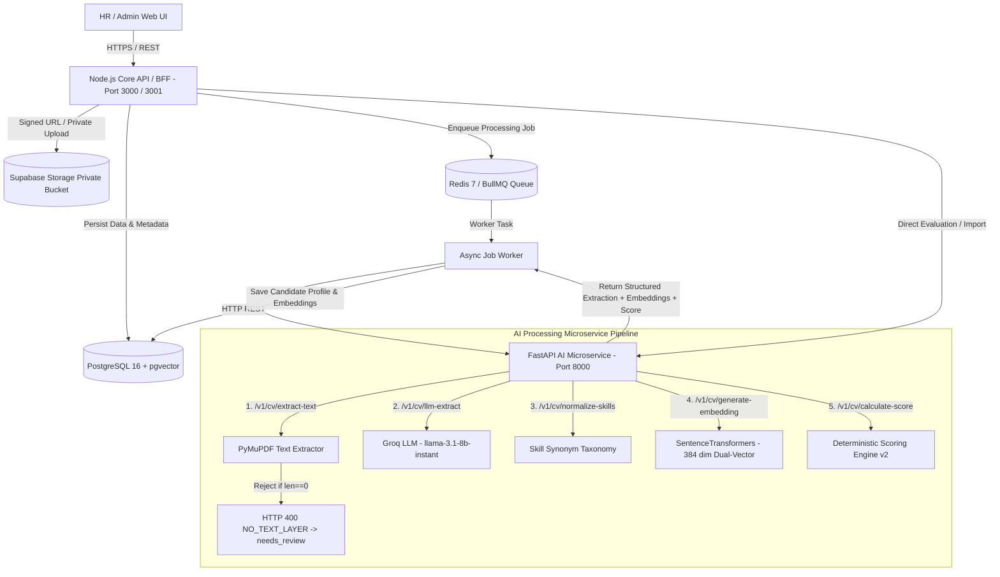
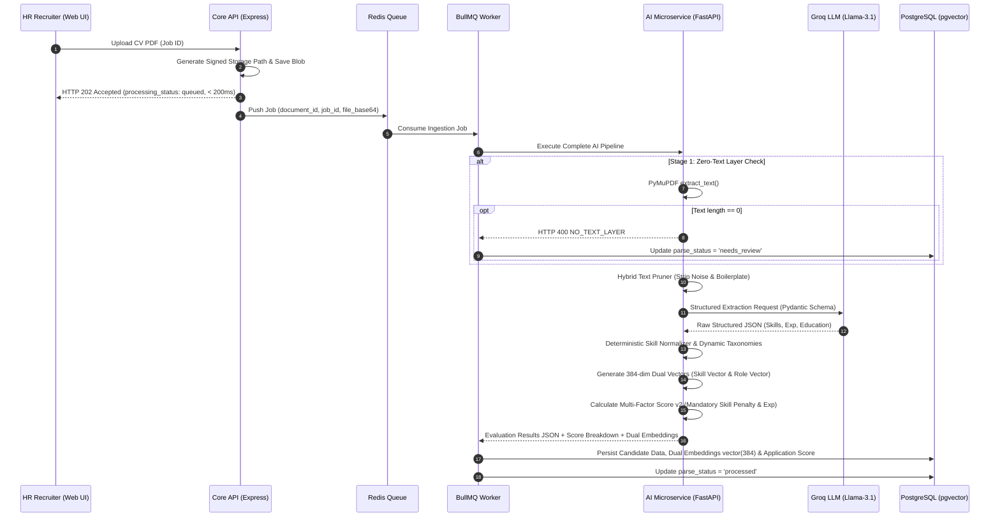

# Architecture Specification: Resumix AI

## 1. Topologi & Ringkasan Arsitektur

Sistem ini dibangun dengan arsitektur **Decoupled Microservices / Monorepo** sebagai *decision-support tool* bagi tim HR (bukan mesin penentu keputusan rekrutmen otomatis).



---

## 2. Service Boundaries & Responsibilities

| Service             | Komponen & Teknologi                                      | Tanggung Jawab Utama                                                                                                                                            | Hal yang Dilarang (Anti-Patterns)                                                        |
|:--------------------|:----------------------------------------------------------|:----------------------------------------------------------------------------------------------------------------------------------------------------------------|:-----------------------------------------------------------------------------------------|
| **Frontend**        | `apps/web`<br>(Next.js 14, TypeScript, Tailwind CSS)      | UI/UX HR, form lowongan, dropzone upload CV, tracking status, preview PDF via signed URL, review/edit hasil AI, visualisasi score breakdown.                    | Bertanggungjawab LLM/Database secrets, menghitung skor otoritatif, query langsung ke DB. |
| **Core API**        | `apps/api`<br>(Node.js, Express, TypeScript)              | Express server (Port 3000/3001). Routing REST `/api/v1`, Auth/RBAC, CRUD domain (Jobs, Candidates, Applications), signed URL, orkestrasi queue.                   | Parsing PDF/OCR/LLM langsung pada HTTP request handler sinkron.                          |
| **Queue Worker**    | `apps/api/src/worker`<br>(Redis, BullMQ Worker)           | Konsumsi job asinkron dari queue, retry management, koordinasi eksekusi pipeline AI, update status di PostgreSQL.                                               | Mengubah status keputusan kandidat (`hired`/`rejected`) secara otomatis.                 |
| **AI Microservice** | `apps/ai-service`<br>(FastAPI, Python 3.11+)              | Microservice REST (Port 8000). Ekstraksi PDF PyMuPDF murni (zero-text rejection), Groq LLM parsing (`llama-3.1-8b-instant`), Dual-Vector Embeddings, normalisasi skill, kalkulasi skor. | Menulis/membaca langsung ke database utama tanpa lewat kontrak REST API API/Worker.      |
| **Database**        | `database`<br>(PostgreSQL 15+ + `pgvector` & `uuid-ossp`) | Storage relasional ternormalisasi (13 tabel), similarity vector search (dimensi 384) via PL/pgSQL function `match_candidates_for_job`, audit log.               | Menyimpan berkas PDF mentah secara langsung di tabel SQL.                                |
| **Private Storage** | Supabase Storage / S3 Private Bucket                      | Penyimpanan berkas PDF CV secara privat dan aman.                                                                                                               | Menjadikan bucket publik tanpa Signed URL berdurasi terbatas (TTL 300s).                 |

---

## 3. Detail Endpoint & REST Interface Contracts

### Core API (`apps/api` — Port 3000 / 3001)
- `GET /` — Root API service status dan daftar endpoint utama.
- `GET /health` — Health check endpoint API dan konektivitas AI Service.
- `GET /api/v1/jobs` — Mengambil daftar lowongan kerja & kualifikasi.
- `POST /api/v1/jobs` — Membuat lowongan kerja baru dan otomatis me-generate `job_embedding` (384-dim).
- `DELETE /api/v1/jobs/:jobId` — Menghapus lowongan kerja secara permanen.
- `POST /api/v1/jobs/import-linkedin` — Import & parse deskripsi lowongan kerja mentah dari LinkedIn/Glints via Groq LLM + auto job embedding.
- `POST /api/v1/cv/embedding` — Generate 384-dimensional multilingual vector embedding (profile, skill, role).
- `POST /api/v1/jobs/:jobId/applications` — Ingestion upload CV asinkron (mengembalikan response HTTP 202 Accepted dalam `< 200ms` dengan `processing_status: queued`).
- `POST /api/v1/jobs/:jobId/evaluate-instant` — Evaluasi CV instan sinkron secara real-time.
- `GET /api/v1/jobs/:jobId/candidates/match` — Mengambil kandidat paling cocok menggunakan similarity search cosine `pgvector` (dengan query parameter `threshold` dan `limit`).
- `GET /api/v1/jobs/:jobId/applications` — Mengambil daftar aplikasi kandidat untuk lowongan tertentu.
- `PATCH /api/v1/applications/:applicationId/status` — Memperbarui status tahapan rekrutmen kandidat (`applied`, `screening`, `interview`, `hired`, `rejected`, `withdrawn`).
- `GET /api/v1/processing-jobs/:processingJobId` — Polling status pekerjaan pemrosesan CV asinkron.

### AI Microservice (`apps/ai-service` — Port 8000)
- `GET /health` — Status kesehatan service, LLM provider (Groq), dan embedding model (`all-MiniLM-L6-v2` / `paraphrase-multilingual-MiniLM-L12-v2`).
- `POST /v1/cv/extract-text` — Menerima file PDF (max 10MB), mengekstrak teks via PyMuPDF. Jika PDF tidak memiliki layer teks (`len(text.strip()) == 0`), mengembalikan HTTP 400 `NO_TEXT_LAYER` dan merekomendasikan `parse_status: needs_review`.
- `POST /v1/cv/llm-extract` — Parsing teks CV ke JSON terstruktur via Groq LLM (`llama-3.1-8b-instant`) berskema Pydantic.
- `POST /v1/cv/normalize-skills` — Normalisasi keyword sinonim skill deterministik berdasarkan taksonomi.
- `POST /v1/cv/generate-embedding` — Generate 384-dimensional vector embeddings (`profile_embedding`, `skill_embedding`, `role_embedding`) menggunakan SentenceTransformers.
- `POST /v1/cv/calculate-score` — Menghitung *job-fit score* (0–100) dan *breakdown* kecocokan kriteria (Dual-Vector & Multi-Factor Scoring Engine v2).
- `POST /v1/job/extract-qualifications` — Parsing teks deskripsi lowongan kerja mentah dari LinkedIn/Glints ke kualifikasi terstruktur dan me-generate dual vector embeddings.
- `GET /v1/skills/taxonomies` — Mengambil seluruh taksonomi sinonim skill static & dynamic.
- `POST /v1/skills/taxonomies` — Menambahkan/mendaftarkan taksonomi sinonim skill kustom domain baru.

---

## 4. End-to-End Workflows Asinkron & Pipeline AI

Pipeline pemrosesan CV di Resumix AI dirancang melalui 7 tahap eksekusi yang terukur:



---

## 5. Skema Database Relasional (PostgreSQL + pgvector)

Database terdiri dari **13 tabel utama** yang didefinisikan melalui file migrasi di `database/migrations/`:

### File Migrasi:
1. `database/migrations/001_initial_schema.sql`: Membuat 12 tabel awal, enum, dan indeks.
2. `database/migrations/002_dual_vector_embeddings.sql`: Menambahkan kolom Dual-Vector Embeddings 384-dim (`candidate_skill_embedding`, `candidate_role_embedding`, `job_skill_embedding`, `job_role_embedding`) dan Stored Procedure PL/pgSQL `match_candidates_for_job`.
3. `database/migrations/003_skill_taxonomies.sql`: Membuat tabel ke-13 `skill_taxonomies` untuk taksonomi sinonim skill kustom domain.

### Rincian Tabel:
1. `users`: Akun pengguna HR/Admin (role: `admin`, `hr_recruiter`, `hiring_manager`, `viewer`).
2. `candidates`: Metadata profil kandidat, JSON snapshot hasil ekstraksi, `profile_embedding` (`vector(384)`), `candidate_skill_embedding` (`vector(384)`), dan `candidate_role_embedding` (`vector(384)`).
3. `candidate_documents`: Tracking berkas PDF, `storage_path`, hash file, raw text, dan `parse_status` (`uploaded`, `queued`, `processing`, `processed`, `needs_review`, `failed`).
4. `candidate_skills`: Skill teridentifikasi & hasil normalisasi per kandidat.
5. `candidate_experiences`: Riwayat posisi, perusahaan, durasi bulan, dan deskripsi kerja.
6. `candidate_educations`: Riwayat pendidikan (S3, S2, S1, D3, SMA/SMK).
7. `job_postings`: Data lowongan kerja, kualifikasi minimum, `job_embedding` (`vector(384)`), `job_skill_embedding` (`vector(384)`), dan `job_role_embedding` (`vector(384)`).
8. `job_required_skills`: Daftar skill wajib (*mandatory*) dan opsional (*preferred*) per lowongan.
9. `applications`: Hubungan kandidat dan lowongan, `status` rekrutmen (`applied`, `screening`, `interview`, `hired`, `rejected`, `withdrawn`), `job_fit_score`, dan `score_breakdown` JSONB.
10. `processing_jobs`: Queue status pemrosesan dokumen (`uploaded`, `queued`, `processing`, `processed`, `needs_review`, `failed`).
11. `score_versions`: Versioning konfigurasi dan formula scoring.
12. `audit_logs`: Log jejak audit tindakan penting sistem.
13. `skill_taxonomies`: Menyimpan daftar sinonim dan kategori skill terstandarisasi.

---

## 6. Mathematical Formulation for Scoring Engine v2

Scoring Engine menghitung skor akhir (rentang 0–100) secara deterministik tanpa halusinasi LLM menggunakan pembobotan *Dual-Vector & Multi-Factor*:

$$\text{Raw Score} = 100 \times \Big( 0.25 \cdot S_{\text{skill\_sem}} + 0.20 \cdot S_{\text{role\_sem}} + 0.30 \cdot S_{\text{man}} + 0.20 \cdot S_{\text{exp}} + 0.05 \cdot S_{\text{pref}} \Big)$$

$$\text{Final Score} = \text{round}\Big( \text{clamp}\big(0.0, 100.0, \text{Raw Score} \times \text{Penalty Factor}\big) \Big)$$

### Komponen Formula:
- **Dual-Vector Semantic Similarity ($S_{\text{sem}} = 0.55 \cdot S_{\text{skill\_sem}} + 0.45 \cdot S_{\text{role\_sem}}$)**:
  - $S_{\text{skill\_sem}}$: Similarity kosinus antar `candidate_skill_embedding` & `job_skill_embedding` (bobot: $0.25$).
  - $S_{\text{role\_sem}}$: Similarity kosinus antar `candidate_role_embedding` & `job_role_embedding` (bobot: $0.20$).
  - *Total bobot semantik gabungan*: $0.45$.
- **Mandatory Skill Match Ratio ($S_{\text{man}}$)**: Rasio kecocokan skill wajib ($\frac{\text{matched mandatory}}{\text{total mandatory}}$) (bobot: $0.30$).
- **Domain Relevant Experience Ratio ($S_{\text{exp}}$)**: Rasio durasi pengalaman relevan ($\min(1.0, \frac{\text{relevant exp months}}{\text{required exp months}})$) (bobot: $0.20$).
- **Preferred Skill Match Ratio ($S_{\text{pref}}$)**: Rasio kecocokan skill opsional ($\frac{\text{matched preferred}}{\text{total preferred}}$) (bobot: $0.05$).

### Mandatory Skill Strict Penalty Factor ($\text{Penalty Factor}$):
Untuk memastikan kandidat tanpa skill utama yang kritikal teridentifikasi dengan jelas:
- **0 missing mandatory skill**: Factor = $1.00$ (tanpa potongan)
- **1 missing mandatory skill**: Factor = $0.75$ (potongan diskon 25%)
- **2 missing mandatory skills**: Factor = $0.50$ (potongan diskon 50%)
- **3+ missing mandatory skills**: Factor = $0.25$ (potongan diskon 75%)

---

## 7. Keamanan Data, PII Guidelines, & Hiring Fairness

1. **Private Object Storage**: Berkas CV disimpan privat. Akses file untuk preview PDF menggunakan Temporary Signed URL dengan TTL maksimum 300 detik.
2. **Kerahasiaan PII**: Log internal dan telemetry dilarang mencetak isi teks mentah CV atau PII (email/telepon/alamat lengkap).
3. **Penyimpanan Secret**: Secret key (`LLM_API_KEY`, `SUPABASE_SERVICE_ROLE_KEY`, `JWT_SECRET`) hanya dikonfigurasi melalui `.env` dan dilarang dikomit ke repo.
4. **Fairness**: Atribut sensitif (foto, jenis kelamin, usia, agama, status pernikahan) tidak boleh mempengaruhi perhitungan skor.

---

## 8. Complete Monorepo Workspace Structure

```text
cv-ats-pipeline/
├── apps/
│   ├── web/                         # Next.js 14 Frontend (TypeScript + Tailwind CSS)
│   ├── api/                         # Node.js Express Core API & Redis BullMQ Worker
│   └── ai-service/                  # FastAPI Python AI Microservice
├── packages/
│   ├── contracts/                   # Shared DTOs & OpenAPI Contracts
│   └── config/                      # Base TSConfig & ESLint Configurations
├── database/
│   ├── migrations/                  # PostgreSQL SQL Migrations
│   │   ├── 001_initial_schema.sql   # Initial 12 Tables Schema & Enums
│   │   ├── 002_dual_vector_embeddings.sql # Dual-Vector Columns & Vector Match Function
│   │   └── 003_skill_taxonomies.sql # Dynamic Skill Taxonomies Table & Seeds
│   ├── seeds/                       # Seed data untuk development
│   └── functions/                   # Stored Procedures & Vector Search Queries
├── docs/
│   ├── Desperated-AGENTS.md         # Reference Guidelines
│   ├── benchmark_report.md          # Benchmark Performance Report
│   └── evaluation.md                # Evaluation Pipeline Notes
├── scripts/
│   ├── start-services.sh            # Script untuk menjalankan seluruh service
│   └── stop-services.sh             # Script untuk menghentikan service
├── docker-compose.yml               # Production Orchestration (PostgreSQL, Redis, AI Service, Core API)
├── docker-compose.dev.yml           # Development Environment with Hot-Reload
├── ARCHITECTURE.md                  # Master Architecture Specification (Single Source of Truth)
├── AGENTS.md                        # Project Rules & Service Boundaries
├── DESIGN.md                        # System Design Specification
├── Plan.md                          # Detailed Project Execution Plan
├── LICENSE                          # GNU AGPL-3.0 Source Code License
├── LICENSE-DOCS.md                  # CC BY-NC-SA 4.0 Documentation License
└── README.md                        # Monorepo Project Overview
```

---

## 9. Lisensi & Perlindungan Hak Cipta Arsitektur

Dokumen arsitektur ini dilindungi di bawah **[Creative Commons Attribution-NonCommercial-ShareAlike 4.0 International (CC BY-NC-SA 4.0)](LICENSE-DOCS.md)**.

* **Penggunaan Evaluasi (HR & Rekrutmen)**: Diperbolehkan penuh untuk keperluan peninjauan kualifikasi dan keahlian teknis pembuat proyek.
* **Penggunaan Komersial**: Perusahaan dilarang menyalin, mereproduksi, atau mengimplementasikan rancangan arsitektur ini untuk kepentingan produk komersial internal/eksternal tanpa izin tertulis dari pemilik hak cipta.
