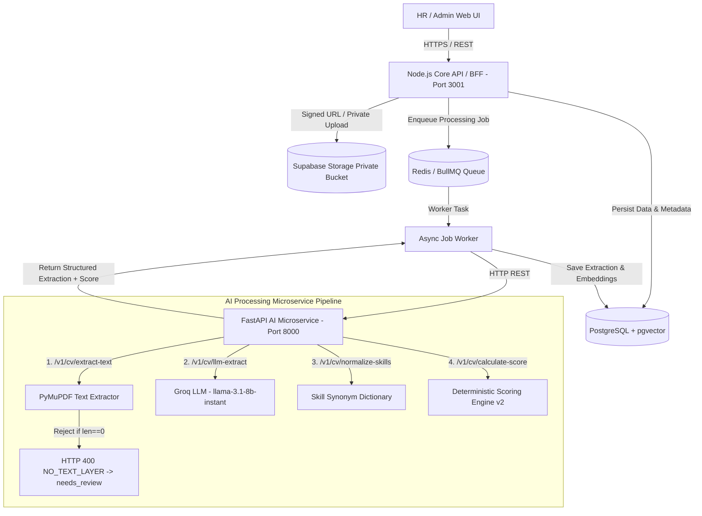
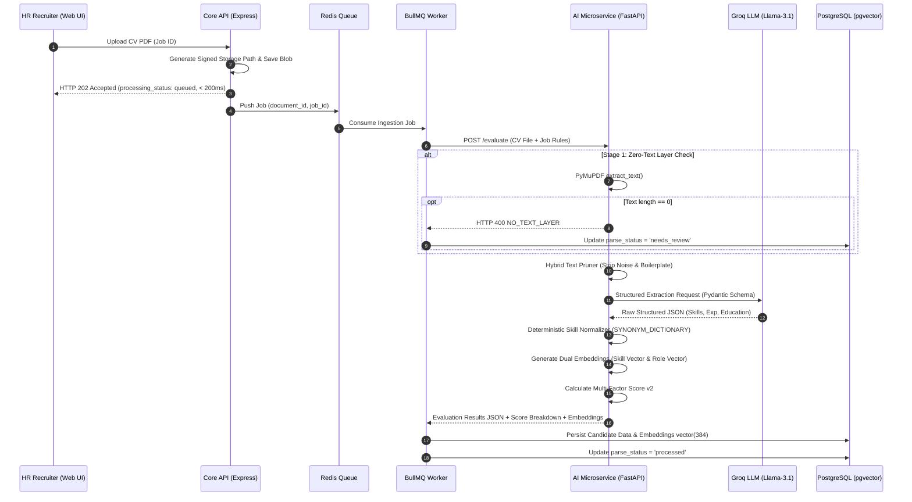

# Architecture Specification: Resumix AI

> **Master Technical Engineering Specification & System Blueprint**  
> Dokumen ini menjelaskan spesifikasi arsitektur sistem, batas layanan (*service boundaries*), alur pemrosesan data asinkron, skema database (12 tabel SQL), serta standar teknis untuk proyek **Resumix AI** (Enterprise Recruitment Intelligence & Next-Gen ATS).

---

## 1. Topologi & Ringkasan Arsitektur

Sistem ini dibangun dengan arsitektur **Decoupled Microservices / Monorepo** sebagai *decision-support tool* bagi tim HR (bukan mesin penentu keputusan rekrutmen otomatis).



---

## 2. Service Boundaries & Responsibilities

| Service | Komponen & Teknologi | Tanggung Jawab Utama | Hal yang Dilarang (Anti-Patterns) |
| :--- | :--- | :--- | :--- |
| **Frontend** | `apps/web`<br>(Next.js 14, TypeScript, Tailwind CSS) | UI/UX HR, form lowongan, dropzone upload CV, tracking status, preview PDF via signed URL, review/edit hasil AI. | Memegang LLM/Database secrets, menghitung skor otoritatif, query langsung ke DB. |
| **Core API** | `apps/api`<br>(Node.js, Express, TypeScript) | Express server (Port 3001). Routing REST `/api/v1`, Auth/RBAC, CRUD domain (Jobs, Candidates, Applications), signed URL, orkestrasi queue. | Parsing PDF/OCR/LLM langsung pada HTTP request handler sinkron. |
| **Queue Worker** | `apps/api/src/worker`<br>(Redis, BullMQ Worker) | Konsumsi job asinkron dari queue, retry management, koordinasi eksekusi pipeline AI, update status di PostgreSQL. | Mengubah status keputusan kandidat (`hired`/`rejected`) secara otomatis. |
| **AI Microservice** | `apps/ai-service`<br>(FastAPI, Python 3.11+) | Microservice REST (Port 8000). Ekstraksi PDF PyMuPDF murni (zero-text rejection), Groq LLM parsing (`llama-3.1-8b-instant`), normalisasi skill, kalkulasi skor. | Menulis/membaca langsung ke database utama tanpa lewat kontrak REST API API/Worker. |
| **Database** | `database`<br>(PostgreSQL 15+ + `pgvector` & `uuid-ossp`) | Storage relasional ternormalisasi (12 tabel), similarity vector search (dimensi 384), audit log. | Menyimpan berkas PDF mentah secara langsung di tabel SQL. |
| **Private Storage** | Supabase Storage / S3 Private Bucket | Penyimpanan berkas PDF CV secara privat dan aman. | Menjadikan bucket publik tanpa Signed URL berdurasi terbatas (TTL 300s). |

---

## 3. Detail Endpoint & REST Interface Contracts

### Core API (`apps/api` — Port 3001)
- `GET /` — Root API service status.
- `GET /health` — Health check endpoint API.
- `GET /api/v1/jobs` — Mengambil daftar lowongan kerja & kualifikasi.
- `POST /api/v1/jobs/:jobId/applications` — Ingestion upload CV asinkron (mengembalikan response `< 200ms` dengan `processing_status: queued`).
- `GET /api/v1/applications/:id` — Mengambil status aplikasi, snapshot CV, dan *score breakdown*.

### AI Microservice (`apps/ai-service` — Port 8000)
- `GET /health` — Status kesehatan service dan penyedia LLM (Groq `llama-3.1-8b-instant`).
- `POST /v1/cv/extract-text` — Menerima file PDF (max 10MB), mengekstrak teks via PyMuPDF. Jika PDF tidak memiliki layer teks (`len(text.strip()) == 0`), mengembalikan HTTP 400 `NO_TEXT_LAYER` dan merekomendasikan `parse_status: needs_review`.
- `POST /v1/cv/llm-extract` — Parsing teks CV ke JSON terstruktur via Groq LLM berskema Pydantic.
- `POST /v1/cv/normalize-skills` — Normalisasi kamus sinonim skill deterministik.
- `POST /v1/cv/calculate-score` — Menghitung *job-fit score* (0–100) dan breakdown kecocokan kriteria.

---

## 4. End-to-End Workflows Asinkron & Pipeline AI

Pipeline pemrosesan CV di Resumix AI dirancang melalui 7 tahap eksekusi yang terukur:



---

## 5. Skema Database Relasional (PostgreSQL + pgvector)

Database terdiri dari 12 tabel utama yang didefinisikan dalam `database/migrations/001_initial_schema.sql`:

1. `users`: Akun pengguna HR/Admin (role: `admin`, `hr_recruiter`, `hiring_manager`, `viewer`).
2. `candidates`: Metadata profil kandidat, JSON snapshot hasil ekstraksi, dan `profile_embedding` (`vector(384)`).
3. `candidate_documents`: Tracking berkas PDF, `storage_path`, hash file, raw text, dan `parse_status`.
4. `candidate_skills`: Skill teridentifikasi & hasil normalisasi per kandidat.
5. `candidate_experiences`: Riwayat posisi, perusahaan, durasi bulan, dan deskripsi kerja.
6. `candidate_educations`: Riwayat pendidikan (S3, S2, S1, D3, SMA/SMK).
7. `job_postings`: Data lowongan kerja, kualifikasi minimum, dan `job_embedding` (`vector(384)`).
8. `job_required_skills`: Daftar skill wajib (*mandatory*) dan opsional (*preferred*) per lowongan.
9. `applications`: Hubungan kandidat dan lowongan, `status` rekrutmen, `job_fit_score`, dan `score_breakdown`.
10. `processing_jobs`: Queue status pemrosesan dokumen (`uploaded`, `queued`, `processing`, `processed`, `needs_review`, `failed`).
11. `score_versions`: Versioning konfigurasi dan formula scoring.
12. `audit_logs`: Log jejak audit tindakan penting sistem.

---

## 6. Mathematical Formulation for Scoring Engine v2

Scoring Engine menghitung skor akhir (rentang 0–100) secara deterministik tanpa halusinasi LLM:

$$\text{Final Score} = 100 \times \Big( 0.45 \cdot S_{\text{sem}} + 0.30 \cdot S_{\text{man}} + 0.20 \cdot S_{\text{exp}} + 0.05 \cdot S_{\text{pref}} \Big)$$

- $S_{\text{sem}}$: Similarity kosinus gabungan antar vector embedding candidate profile & job posting (0.0 – 1.0) via `pgvector`.
- $S_{\text{man}}$: Rasio kecocokan skill wajib ($\frac{\text{matched mandatory}}{\text{total mandatory}}$).
- $S_{\text{exp}}$: Rasio durasi pengalaman ($\min(1.0, \frac{\text{candidate experience}}{\text{required experience}})$).
- $S_{\text{pref}}$: Rasio kecocokan skill opsional ($\frac{\text{matched preferred}}{\text{total preferred}}$).

---

## 7. Keamanan Data, PII Guidelines, & Hiring Fairness

1. **Private Object Storage**: Berkas CV disimpan privat. Akses file untuk preview PDF menggunakan Temporary Signed URL dengan TTL maksimum 300 detik.
2. **Kerahasiaan PII**: Log internal dan telemetry dilarang mencetak isi teks mentah CV atau PII (email/telepon/alamat lengkap).
3. **Penyimpanan Secret**: Secret key (`LLM_API_KEY`, `SUPABASE_SERVICE_ROLE_KEY`, `JWT_SECRET`) hanya dikonfigurasi melalui `.env` dan dilarang dikomit ke repo.
4. **Fairness**: Atribut sensitif (foto, jenis kelamin, usia, agama, status pernikahan) tidak boleh mempengaruhi perhitungan skor.

---

## 8. Complete Monorepo Workspace Structure

```text
cv-ats-pipeline/
├── apps/
│   ├── web/                         # Next.js 14 Frontend (TypeScript + Tailwind CSS)
│   ├── api/                         # Node.js Express Core API & Redis Worker
│   └── ai-service/                  # FastAPI Python AI Microservice
├── packages/
│   ├── contracts/                   # Shared DTOs & OpenAPI Contracts
│   └── config/                      # Base TSConfig & ESLint Configurations
├── database/
│   ├── migrations/                  # PostgreSQL SQL Migrations (001_initial_schema.sql)
│   ├── seeds/                       # Seed data untuk development
│   └── functions/                   # Stored Procedures & Vector Search Queries
├── docs/
│   ├── architecture.md              # Salinan Dokumen Arsitektur
│   ├── api.md                       # Spesifikasi REST API
│   ├── scoring.md                   # Spesifikasi Scoring Engine
│   └── security.md                  # Keamanan & Kebijakan PII
├── docker-compose.yml               # Production Orchestration
├── docker-compose.dev.yml           # Development Environment with Hot-Reload
├── ARCHITECTURE.md                  # Master Architecture Specification
├── AGENTS.md                        # Operational Guidelines for AI Agents
├── LICENSE                          # GNU AGPL-3.0 Source Code License
├── LICENSE-DOCS.md                  # CC BY-NC-SA 4.0 Documentation License
└── README.md                        # Monorepo Project Overview
```

---

## 9. Lisensi & Perlindungan Hak Cipta Arsitektur

Dokumen arsitektur ini dilindungi di bawah **[Creative Commons Attribution-NonCommercial-ShareAlike 4.0 International (CC BY-NC-SA 4.0)](LICENSE-DOCS.md)**.

* **Penggunaan Evaluasi (HR & Rekrutmen)**: Diperbolehkan penuh untuk keperluan peninjauan kualifikasi dan keahlian teknis pembuat proyek.
* **Penggunaan Komersial**: Perusahaan dilarang menyalin, mereproduksi, atau mengimplementasikan rancangan arsitektur ini untuk kepentingan produk komersial internal/eksternal tanpa izin tertulis dari pemilik hak cipta.
