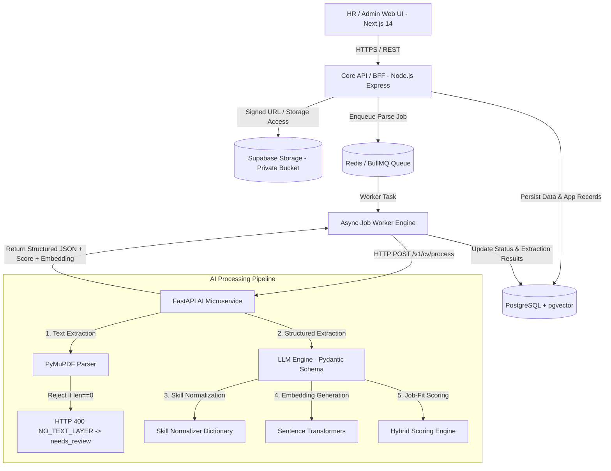

# CV ATS Pipeline - Enterprise Candidate Screening System

Sistem Applicant Tracking System (ATS) modern berbasis arsitektur mikroservis terpisah (decoupled monorepo) yang dirancang untuk pengolahan CV kandidat secara otomatis. Sistem ini menggabungkan ekstraksi teks PDF berbasis PyMuPDF, penolakan ketat PDF tanpa layer teks (*zero-text rejection rule*), ekstraksi terstruktur berbantuan LLM dengan skema Pydantic, normalisasi skill deterministik, pencarian vektor via `pgvector`, serta engine perhitungan *job-fit score* yang transparan dan dapat diaudit.

---

## 1. Overview dan Prinsip Perancangan

CV ATS Pipeline dirancang khusus sebagai **decision-support tool** bagi tim HR / Recruiter, bukan sebagai mesin penentu keputusan rekrutmen otomatis. 

### Prinsip Utama Sistem
- **Human-in-the-Loop**: AI tidak pernah membuat keputusan penolakan atau penerimaan kandidat secara independen. Sistem menyediakan skor kecocokan beserta rincian alasannya (*score breakdown*) agar HR dapat membuat keputusan yang terukur.
- **Asynchronous Processing**: Pemrosesan dokumen CV (LLM, embedding, scoring) dilakukan secara asinkron menggunakan antrean (*job queue*) untuk mencegah *request timeout* dan memastikan respons API tetap di bawah 200 md.
- **Keamanan Data dan Privasi (PII)**: Berkas CV disimpan dalam penyimpanan objek privat (*private object storage*). Akses berkas oleh pengguna dilakukan melalui *Signed URL* berjangka waktu singkat.
- **Scoring Fairness**: Proses penilaian kecocokan (*job-fit scoring*) murni didasarkan pada kompetensi teknis, kualifikasi skill wajib, dan durasi pengalaman kerja. Atribut sensitif seperti foto, usia, jenis kelamin, agama, lokasi detail, atau status pernikahan dilarang digunakan dalam scoring.

---

## 2. Arsitektur Sistem dan Batas Layanan

Sistem mengadopsi pola arsitektur **Decoupled Monorepo** yang memisahkan tanggung jawab antara *Web Dashboard*, *Core API / BFF*, *Job Worker*, dan *AI Microservice*.



### Tabel Batas Layanan (Service Boundaries)

| Layanan / Komponen | Tanggung Jawab Utama | Hal yang Dilarang |
| :--- | :--- | :--- |
| **Frontend (`apps/web`)** | UI/UX HR, form lowongan kerja, upload dropzone CV, visualisasi status proses, preview PDF, dan form review/edit hasil AI. | Memegang API key/secret internal, menghitung skor otoritatif, atau melakukan query langsung ke database. |
| **Core API (`apps/api`)** | Auth/RBAC, manajemen domain (Jobs, Candidates, Applications), enkapsulasi signed URL storage, dan orkestrasi queue. | Melakukan parsing PDF atau pemanggilan LLM langsung di dalam request handler HTTP sinkron. |
| **Job Worker (`apps/api/src/worker`)** | Mengambil job dari Redis Queue, mengelola mekanisme retry, memanggil AI Microservice, dan mengonfirmasi pembaruan status DB. | Menentukan keputusan rekrutmen kandidat secara otomatis tanpa pengawasan HR. |
| **AI Service (`apps/ai-service`)** | Parsing PDF (PyMuPDF), zero-text rejection, ekstraksi terstruktur LLM, validasi Pydantic, normalisasi skill, pembuatan embedding, dan perhitungan scoring. | Menulis atau mengubah data langsung ke PostgreSQL tanpa melalui kontrak API/Worker. |
| **PostgreSQL + `pgvector`** | Menyimpan data relasional ternormalisasi, indeks pencarian vektor kemiripan, audit log, dan tracking status pekerjaan. | Menyimpan berkas biner PDF CV secara langsung di dalam kolom tabel. |
| **Storage (`Supabase Storage`)** | Menyimpan berkas CV asli secara privat dalam struktur terisolasi. | Menjadikan bucket berstatus publik tanpa proteksi signed URL. |

---

## 3. Alur Kerja Ingestion dan Pemrosesan Asinkron

Untuk menangani unggahan berkas CV dalam jumlah besar dan mengantisipasi latensi pemrosesan LLM & embedding, sistem menggunakan alur ingestion asinkron sebagai berikut:

```text
1. HR / Kandidat Mengunggah CV PDF via Web UI
   └─> Core API memvalidasi MIME type, ukuran berkas (maksimal 10 MB), proteksi PDF enkripsi/bomb.
   └─> Berkas disimpan ke Supabase Storage private bucket (jalur: cv-files/raw/{document_id}.pdf).
   └─> Record 'applications' dibuat dengan status 'applied'.
   └─> Record 'candidate_documents' dibuat dengan parse_status 'uploaded'.
   └─> Job pemrosesan dimasukkan ke Redis Queue (processing_jobs status 'queued').
   └─> Core API langsung mengembalikan respon HTTP 202 Accepted (< 200 ms) berisi application_id & processing_job_id.

2. Pemrosesan Asinkron oleh Worker Engine
   └─> Worker mengambil job dari queue dan memperbarui parse_status menjadi 'processing'.
   └─> Worker memanggil FastAPI AI Service pada endpoint /v1/cv/process.
   └─> FastAPI mengeksekusi ekstraksi teks PyMuPDF.
   └─> Jika PDF tidak memiliki layer teks (len == 0), sistem menolak pemrosesan dengan error HTTP 400 NO_TEXT_LAYER dan menandai parse_status dokumen sebagai 'needs_review'.
   └─> Teks mentah dikirim ke LLM untuk ekstraksi terstruktur sesuai skema Pydantic.
   └─> Skill yang diekstrak melewati kamus normalisasi deterministik.
   └─> Model Sentence Transformers menghasilkan profile_embedding untuk kandidat.
   └─> Engine Scoring menghitung nilai kecocokan (0-100) dan rincian score_breakdown.
   └─> Worker menyimpan parsed_cv_json, candidate_skills, profile_embedding, dan score_breakdown ke PostgreSQL.
   └─> Worker mengubah parse_status menjadi 'processed' (atau 'needs_review' jika ada warning, atau 'failed' jika fatal error).
```

---

## 4. Struktur Repository Monorepo

```text
cv-ats-pipeline/
├── apps/
│   ├── web/                         # Next.js 14 HR Dashboard (TypeScript + Tailwind CSS)
│   ├── api/                         # Node.js / Express Core API & BullMQ Worker Engine
│   └── ai-service/                  # FastAPI Python AI Microservice
├── packages/
│   ├── contracts/                   # Shared DTOs, OpenAPI Specs, & JSON Schemas
│   └── config/                      # Shared TSConfig, ESLint, & Prettier rules
├── database/
│   ├── migrations/                  # PostgreSQL SQL Migrations (12 Core Tables & pgvector)
│   ├── seeds/                       # Seed data untuk pengujian & pengembangan lokal
│   └── functions/                   # Custom SQL functions & kueri pencarian vektor
├── docs/                            # Dokumentasi Spesifikasi & Arsitektur Moduler
│   ├── architecture.md              # Spesifikasi Arsitektur Utama & System Boundaries
│   ├── brainstorming-rag-pipeline.md# Dokumen Analisis & Rencana Pengembangan Pipeline
│   ├── front-end-pipeline.md        # Spesifikasi UI/UX, Component Tree, & Design Token
│   ├── api.md                       # Dokumentasi Kontrak REST API v1
│   ├── scoring.md                   # Formulasi Matrik & Spesifikasi Scoring Hybrid
│   ├── security.md                  # Keamanan, PII, RBAC, & Retensi Data
│   └── evaluation.md                # Evaluasi Kualitas AI, Corpus Test, & Target Metrik
├── infra/
│   ├── docker/                      # Multi-stage Dockerfile untuk tiap mikroservis
│   └── scripts/                     # Script automasi migrasi & pengujian
├── docker-compose.yml               # Kontainerisasi Produksi
├── docker-compose.dev.yml           # Kontainerisasi Pengembangan Lokal (Hot-Reload)
├── .env.example                     # Template Variabel Lingkungan
├── AGENTS.md                        # Panduan Operasional & Aturan AI Agent
└── README.md                        # Master Dokumen Portofolio Utama
```

---

## 5. Pipeline Pemrosesan AI dan LLM Extraction

### A. Ekstraksi Teks PDF dan Zero-Text Rejection Rule

Ekstraksi awal menggunakan PyMuPDF karena latensinya yang sangat rendah (< 1 detik). Untuk mengoptimalkan efisiensi sumber daya dan kecepatan pemrosesan, sistem tidak menggunakan fallback OCR. Jika PDF terdeteksi berupa gambar/scan tanpa layer teks (`len(raw_text.strip()) == 0`), sistem langsung menghentikan pipeline dengan error `NO_TEXT_LAYER` (HTTP 400) dan menandai status dokumen sebagai `needs_review` untuk tindakan tim HR.

Aturan penolakan teks diimplementasikan dalam Python sebagai berikut:

```python
if len(raw_text.strip()) == 0:
    raise ValueError("NO_TEXT_LAYER: Berkas PDF tidak memiliki layer teks yang dapat dibaca. Harap unggah PDF asli berbasis teks.")
```

Setiap proses ekstraksi menghasilkan metadata kualitas:

```json
{
  "parser": "pymupdf",
  "ocr_used": false,
  "page_count": 2,
  "extracted_characters": 4218,
  "processing_time_ms": 875,
  "quality_score": 0.92
}
```

---

### B. Structured Extraction dengan Pydantic Schema

Data hasil ekstraksi dibentuk ke dalam struktur Pydantic ter-tipe kuat untuk menjamin keabsahan tipe data sebelum disimpan ke database:

```python
from datetime import date
from typing import Literal
from pydantic import BaseModel, Field, EmailStr

class Contact(BaseModel):
    email: EmailStr | None = None
    phone_number: str | None = None
    linkedin_url: str | None = None
    portfolio_url: str | None = None
    location: str | None = None

class Skill(BaseModel):
    name: str
    normalized_name: str | None = None
    category: Literal[
        "programming_language",
        "framework",
        "database",
        "cloud",
        "tool",
        "soft_skill",
        "other"
    ] = "other"

class WorkExperience(BaseModel):
    company: str | None = None
    role: str | None = None
    start_date: date | None = None
    end_date: date | None = None
    is_current: bool = False
    duration_months: int | None = Field(default=None, ge=0)
    description: str | None = None
    skills_used: list[str] = Field(default_factory=list)

class Education(BaseModel):
    institution: str | None = None
    degree: str | None = None
    major: str | None = None
    start_year: int | None = None
    end_year: int | None = None

class CVExtraction(BaseModel):
    full_name: str | None = None
    contact: Contact = Field(default_factory=Contact)
    summary: str | None = None
    skills: list[Skill] = Field(default_factory=list)
    work_experience: list[WorkExperience] = Field(default_factory=list)
    education: list[Education] = Field(default_factory=list)
    certifications: list[str] = Field(default_factory=list)
    projects: list[str] = Field(default_factory=list)
    total_experience_months: int | None = Field(default=None, ge=0)
    extraction_warnings: list[str] = Field(default_factory=list)
```

---

### C. Aturan Prompt Engineering dan Anti-Halusinasi

Instruksi sistem (*System Prompt*) dirancang secara eksplisit untuk mencegah halusinasi data:

```text
Anda adalah mesin ekstraksi data CV kandidat untuk sistem ATS enterprise.

Aturan Wajib:
1. Ekstrak HANYA fakta yang tertulis secara eksplisit pada teks CV.
2. Dilarang menyimpulkan tingkat senioritas, keahlian tambahan, atau kualifikasi yang tidak tertera.
3. Gunakan nilai null untuk objek/skalar dan [] untuk daftar jika data tidak ditemukan.
4. Dilarang menambahkan kunci (keys) di luar skema JSON yang ditentukan.
5. Hitung durasi kerja hanya dari rentang tanggal yang eksplisit. Jika tanggal ambigu, isi duration_months sebagai null dan tambahkan pesan peringatan pada extraction_warnings.
6. Keluarkan JSON murni yang mematuhi skema tanpa penjelasan naratif atau format markdown codeblock.
```

---

### D. Normalisasi Skill Deterministik

Sebelum dilakukan pencocokan skill atau pembuatan embedding, skill yang diekstrak melewati kamus sinonim deterministik untuk menyatukan variasi penulisan tanpa mengubah data mentah asli:

```json
{
  "reactjs": "React",
  "react.js": "React",
  "node": "Node.js",
  "nodejs": "Node.js",
  "postgres": "PostgreSQL",
  "postgre": "PostgreSQL",
  "postgresql": "PostgreSQL",
  "py": "Python",
  "golang": "Go",
  "ts": "TypeScript"
}
```

---

### E. Engine Perhitungan Job-Fit Score (Hybrid Scoring Formula)

Skor kecocokan kandidat ($S$) dihitung menggunakan gabungan kemiripan semantik dan aturan bisnis deterministik pada rentang **0 hingga 100**:

$$S = 100 \times \left( 0.45 S_{\text{semantic}} + 0.30 S_{\text{mandatory}} + 0.20 S_{\text{experience}} + 0.05 S_{\text{preferred}} \right)$$

Komponen Penilaian:
- $S_{\text{semantic}}$: *Cosine similarity* antara embedding profil kandidat dan embedding deskripsi lowongan (skala 0.0–1.0).
- $S_{\text{mandatory}}$: Rasio pemenuhan skill wajib yang dimiliki kandidat terhadap total skill wajib lowongan.
- $S_{\text{experience}}$: Rasio total pengalaman kerja kandidat ($M_{\text{candidate}}$) terhadap batas pengalaman minimum lowongan ($M_{\text{minimum}}$), dibatasi nilai maksimum 1.0:

$$S_{\text{experience}} = \min\left(1.0, \frac{M_{\text{candidate}}}{M_{\text{minimum}}}\right)$$

- $S_{\text{preferred}}$: Rasio pemenuhan skill tambahan/opsional.

Setiap penilaian menghasilkan rincian transparan (*score breakdown*) yang disimpan pada tabel `applications`:

```json
{
  "score_version": "v1",
  "semantic_similarity": 0.82,
  "mandatory_skill_score": 0.75,
  "experience_score": 1.00,
  "preferred_skill_score": 0.60,
  "final_score": 84.4,
  "matched_skills": ["Python", "PostgreSQL", "Docker"],
  "missing_mandatory_skills": ["Kubernetes"],
  "experience_summary": {
    "candidate_months": 36,
    "required_months": 24,
    "status": "met"
  }
}
```

---

### F. Vector Search dan Discovery dengan `pgvector`

Untuk pencarian kandidat skala besar (*candidate discovery*), sistem memanfaatkan indeks vektor PostgreSQL via `pgvector`:

```sql
SELECT
  c.id,
  c.full_name,
  1 - (c.profile_embedding <=> j.job_embedding) AS semantic_similarity
FROM candidates c
JOIN job_postings j ON j.id = :job_id
WHERE j.status = 'open'
ORDER BY c.profile_embedding <=> j.job_embedding
LIMIT 20;
```

---

## 6. Rancangan Model Data (Database Schema)

Sistem menggunakan database PostgreSQL dengan 12 tabel utama yang ter-normalisasi:

```text
users (HR / Admin)
  └── job_postings
         ├── job_required_skills
         └── applications ─────── candidates
                                    ├── candidate_documents
                                    ├── candidate_skills
                                    ├── candidate_experiences
                                    └── candidate_educations
processing_jobs (Queue Audit)
score_versions (Scoring Config)
audit_logs (Security Audit)
```

### Kolom Kritis Tabel Utama

- **`candidates`**: `id` (UUID), `full_name`, `email`, `phone_number`, `total_experience_months`, `parsed_cv_json` (JSONB), `profile_embedding` (`vector(384)`), `created_at`, `updated_at`.
- **`candidate_documents`**: `id`, `candidate_id`, `storage_path`, `original_filename`, `mime_type`, `size_bytes`, `file_hash` (SHA-256 deduplikasi), `parse_status` (`uploaded` | `queued` | `processing` | `processed` | `needs_review` | `failed`), `raw_text`, `parser_metadata` (JSONB), `uploaded_at`.
- **`job_postings`**: `id`, `title`, `description`, `minimum_experience_months`, `status` (`draft` | `open` | `closed`), `job_embedding` (`vector(384)`), `created_by`, `created_at`.
- **`applications`**: `id`, `candidate_id`, `job_id`, `document_id`, `status` (`applied` | `screening` | `interview` | `rejected` | `hired` | `withdrawn`), `job_fit_score` (Numeric 0-100), `score_breakdown` (JSONB), `applied_at`.
- **`processing_jobs`**: `id`, `document_id`, `job_type`, `status`, `attempt_count`, `error_code`, `error_message`, `started_at`, `completed_at`.

---

## 7. Spesifikasi dan Kontrak API v1

Seluruh endpoint REST API diakses melalui prefix `/api/v1`.

### Ringkasan Endpoint Utama

| Method | Endpoint Path | Deskripsi |
| :--- | :--- | :--- |
| **POST** | `/api/v1/jobs` | Membuat lowongan kerja baru beserta kriteria skill wajib/tambahan. |
| **GET** | `/api/v1/jobs` | Mengambil daftar lowongan kerja dengan filter status & pencarian. |
| **GET** | `/api/v1/jobs/:jobId` | Mengambil detail lowongan kerja beserta statistik kandidat. |
| **POST** | `/api/v1/jobs/:jobId/applications` | Mengunggah CV kandidat untuk lowongan spesifik (Multipart Form Data). |
| **GET** | `/api/v1/jobs/:jobId/applications` | Mengambil daftar aplikasi kandidat pada lowongan kerja spesifik. |
| **GET** | `/api/v1/applications/:applicationId` | Mengambil detail aplikasi, profil parsing, score breakdown, & Signed URL CV. |
| **PATCH** | `/api/v1/applications/:applicationId/status` | Memperbarui tahap rekrutmen kandidat (`screening`, `interview`, dll). |
| **POST** | `/api/v1/applications/:applicationId/reprocess` | Memicu pemrosesan ulang dokumen CV oleh worker AI. |
| **GET** | `/api/v1/jobs/:jobId/rankings` | Mengambil pemeringkatan kandidat berdasarkan gabungan skor hybrid & vektor. |
| **GET** | `/api/v1/processing-jobs/:processingJobId` | Melakukan polling status pemrosesan dokumen CV. |

### Respon Asinkron Endpoint Upload

Saat CV diunggah via `POST /api/v1/jobs/:jobId/applications`, API mengembalikan respons cepat tanpa menunggu proses LLM selesai:

```json
{
  "application_id": "4b7099bb-1e75-4ca1-a243-d2ff1e215c7a",
  "document_id": "6f2b98f0-4f4f-43f6-9432-488942782e7b",
  "processing_job_id": "9c1a33ee-8811-42ab-b411-11aa22bb33cc",
  "processing_status": "queued",
  "message": "CV berhasil diunggah dan sedang diproses dalam antrean."
}
```

---

## 8. Keamanan Data, Privasi (PII), dan Tata Kelola

- **Private Object Storage & Temporary Signed URL**: Berkas PDF CV disimpan pada Supabase Storage berstatus privat. Pengguna web UI hanya mendapatkan akses baca berkas melalui Signed URL dengan waktu kedaluwarsa singkat (TTL 300 detik).
- **Role-Based Access Control (RBAC)**: Pembatasan hak akses bertingkat (`admin`, `hr_recruiter`, `hiring_manager`, `viewer`) untuk mengakses dokumen CV dan memperbarui status kandidat.
- **Redaksi PII pada Logging**: Sistem melarang pencetakan isi teks mentah CV, nomor telepon, alamat email, atau API key pada log aplikasi atau platform observabilitas.
- **Perlindungan Ingestion Berkas**: Validasi ketat terhadap header berkas (magic bytes), batas ukuran maksimal 10 MB, pembatasan jumlah halaman maksimal 10 halaman, dan penolakan PDF terenkripsi/password.
- **Audit Logging**: Setiap aksi krusial (pembacaan berkas CV, pembaruan status aplikasi, perbaikan data kandidat, dan pemicu pemrosesan ulang) dicatat pada tabel `audit_logs`.

---

## 9. Metrik Evaluasi Kualitas AI

Pipeline AI diuji secara berkala menggunakan *CV Test Corpus* anonim untuk memastikan keandalan hasil ekstraksi:

| Metrik Evaluasi | Formula / Definisi | Target Minimal |
| :--- | :--- | :--- |
| **JSON Validity Rate** | Rasio keluaran LLM yang mematuhi skema Pydantic tanpa error sintaks. | $\ge 98\%$ |
| **Contact Extraction Accuracy** | Akurasi ekstraksi field email dan nomor telepon terhadap data acuan (*ground truth*). | $\ge 98\%$ |
| **Skill Extraction F1-Score** | *Harmonic mean* dari presisi dan recall ekstraksi skill kandidat. | $\ge 0.80$ |
| **Digital PDF Latency** | Waktu pemrosesan total untuk PDF berbasis teks digital. | $< 10\text{ detik}$ |
| **Textless Rejection Latency** | Waktu deteksi dan penolakan PDF scanned/tanpa layer teks. | $< 0.5\text{ detik}$ |
| **Manual Correction Rate** | Persentase data hasil ekstraksi yang memerlukan koreksi manual oleh HR. | $< 20\%$ |

Dokumentasi detail mengenai corpus pengujian dapat diakses pada [docs/evaluation.md](file:///home/aditlinux/Dokumen/GitFolder/Architecture-RAG-pipeline/docs/evaluation.md).

---

## 10. Panduan Instalasi dan Pengoperasian (Quick Start)

### Prasyarat Sistem
- Docker Engine $\ge 24.0$ & Docker Compose $\ge 2.20$
- Node.js $\ge 18.0$ (untuk pengembangan lokal tanpa kontainer)
- Python $\ge 3.11$ (untuk pengembangan AI Service lokal)

### 1. Kloning Repository dan Konfigurasi Environment
```bash
git clone https://github.com/user/cv-ats-pipeline.git
cd cv-ats-pipeline
cp .env.example .env
```

### 2. Menjalankan Lingkungan Pengembangan (Local Dev)
Gunakan `docker-compose.dev.yml` untuk menjalankan seluruh dependensi (PostgreSQL, Redis, Core API, AI Service, dan Web UI) dengan fitur *hot-reload*:

```bash
docker compose -f docker-compose.dev.yml up --build
```

### 3. Akses Layanan Lokal
- **HR Web Dashboard**: `http://localhost:3000`
- **Core REST API v1**: `http://localhost:3001/api/v1`
- **FastAPI OpenAPI Docs**: `http://localhost:8000/docs`

---

## 11. Indeks Dokumentasi Lanjutan

Untuk informasi teknis yang lebih terperinci, silakan merujuk pada dokumen di folder `docs/`:

- [Spesifikasi Arsitektur Sistem](file:///home/aditlinux/Dokumen/GitFolder/Architecture-RAG-pipeline/docs/architecture.md)
- [Dokumen Analisis & Brainstorming Pipeline RAG/ATS](file:///home/aditlinux/Dokumen/GitFolder/Architecture-RAG-pipeline/docs/brainstorming-rag-pipeline.md)
- [Spesifikasi Front-End & Desain UX](file:///home/aditlinux/Dokumen/GitFolder/Architecture-RAG-pipeline/docs/front-end-pipeline.md)
- [Spesifikasi Kontrak REST API v1](file:///home/aditlinux/Dokumen/GitFolder/Architecture-RAG-pipeline/docs/api.md)
- [Formulasi & Spesifikasi Job-Fit Scoring](file:///home/aditlinux/Dokumen/GitFolder/Architecture-RAG-pipeline/docs/scoring.md)
- [Kebijakan Keamanan Data, PII, & RBAC](file:///home/aditlinux/Dokumen/GitFolder/Architecture-RAG-pipeline/docs/security.md)
- [Laporan Evaluasi Metrik & Corpus AI](file:///home/aditlinux/Dokumen/GitFolder/Architecture-RAG-pipeline/docs/evaluation.md)
