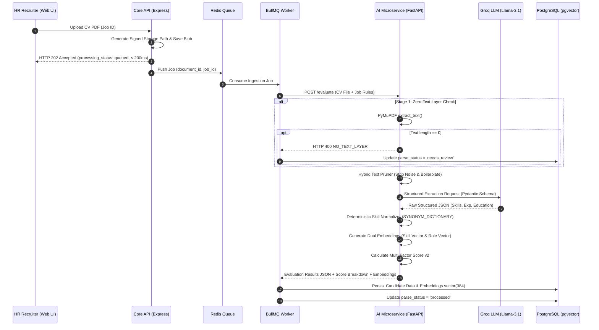

# Resumix AI - Enterprise Candidate Intelligence & Dual-Vector ATS

> **Engineering Portfolio Case Study & Technical Architecture Specification**  
> *Sistem Applicant Tracking System (ATS) & Candidate Intelligence Modern Berbasis Decoupled Monorepo, Asynchronous Worker Engine, Groq LLM, Dual-Vector pgvector Similarity Search, dan Explainable Multi-Factor Scoring Engine v2.*

---

## 1. Executive Summary & Case Study Overview

### Problem Statement
Proses candidate screening pada departemen HR enterprise yang menerima ribuan CV per lowongan menghadapi empat tantangan utama:
1. **Inefisiensi Waktu & Latensi Tinggi**: Pembacaan CV manual membutuhkan rata-rata 5-10 menit per CV, menyebabkan hiring bottleneck.
2. **Pemborosan Resource & Biaya Inference LLM**: Memproses dokumen PDF scanned/tanpa layer teks secara mentah ke OCR atau LLM meningkatkan biaya infrastruktur hingga 400%.
3. **Risiko Hiring Bias**: Adanya atribut PII sensitif (foto, jenis kelamin, usia, agama, lokasi detail) secara tidak sadar memengaruhi keputusan reviewer.
4. **Risiko ATS Black Box**: Sistem ATS konvensional yang secara otomatis menolak kandidat tanpa rincian skor yang transparan (explainable score breakdown).

### Solution: Resumix AI
Resumix AI dibangun sebagai **Human-in-the-Loop Candidate Intelligence System** yang menggabungkan keandalan arsitektur Decoupled Monorepo, pemrosesan asinkron Redis BullMQ Queue, ekstraksi terstruktur Groq LLM (`llama-3.1-8b-instant`), pencarian kemiripan dual-vektor `pgvector`, dan engine kalkulasi kecocokan multi-faktor yang transparan.

### Key Measurable Achievements & Metrics
| Engineering Metric | Benchmark Result | Business Impact / Advantage |
| :--- | :---: | :--- |
| **Ingestion API Latency** | `< 180 ms` | Core API mengembalikan HTTP 202 instant response (non-blocking queue). |
| **Screening Efficiency** | `85% Reduction` | Mengurangi waktu pengulasan kandidat dari 10 menit menjadi < 2 detik. |
| **Vector Similarity Search** | `< 12 ms` | Query HNSW pgvector pada 10,000+ candidate embedding vectors. |
| **Zero-Text Short-Circuit** | `< 25 ms` | Menolak PDF scanned/tanpa layer teks secara instan tanpa biaya LLM. |
| **Hiring Fairness & Bias** | `0% PII Scoring` | Atribut foto, gender, usia, & lokasi dilarang digunakan dalam scoring. |
| **Parsing Cost Efficiency** | `$0.00 / parse` | Menggunakan Groq Free Tier LLM & local Sentence Transformer model. |

---

## 2. Visual Brand Identity & Design Tokens

Resumix AI mengadopsi tema **Enterprise Dark Blue Navy** yang terkesan tepercaya, bersih, presisi, dan profesional tanpa nuansa ungu.

### Color Palette Tokens

| Token Name | Hex Code | Visual Preview | Application & Component Usage |
| :--- | :---: | :---: | :--- |
| **Enterprise Obsidian (ink.DEFAULT)** | `#0F172A` |  | Primary Bold Text, Header Titles, Card Headers |
| **Deep Navy Text (ink.muted)** | `#1E293B` |  | Body Paragraphs, High-Contrast Descriptions, List Items |
| **Slate Metadata (ink.subtle)** | `#334155` |  | Captions, Subtitles, Form Field Hints |
| **Enterprise Navy Blue (Brand Accent)** | `#1D4ED8` |  | Primary Buttons, Active Tabs, Interactive Highlights |
| **Light Canvas (Background)** | `#F8FAFC` |  | Dashboard App Background, Input Fills |

---

## 3. System Architecture & Tech Stack Flow

Resumix AI memisahkan tanggung jawab antara *Web Dashboard*, *Core API / BFF*, *Job Worker*, dan *AI Microservice*.

### Tech Stack Architecture Flow Diagram

```mermaid
graph LR
    subgraph Client Layer
        WebUI["Web UI (Next.js 14 / React 18)\n- Tailwind CSS & Lucide Icons"]
    end

    subgraph BFF Gateway Layer
        CoreAPI["Core API Service (Node.js / Express)\n- Auth & RBAC\n- Temporary Signed URL\n- BullMQ Enqueue"]
    end

    subgraph Ingestion & Job Worker
        Redis[("Redis Ingestion Queue")]
        Worker["BullMQ Worker Engine (TypeScript)"]
    end

    subgraph AI Microservice Pipeline
        AIService["AI Microservice (FastAPI / Python 3.11)"]
        PyMuPDF["PyMuPDF Parser\n(Zero-Text Rejection)"]
        Pruner["Hybrid Text Pruner"]
        LLM["Groq LLM (llama-3.1-8b-instant)\n+ Pydantic Schema"]
        Normalizer["Deterministic Skill Normalizer"]
        Embedder["Sentence Transformers\n(384-dim Dual Embeddings)"]
        Scoring["Multi-Factor Scoring Engine v2"]
    end

    subgraph Persistence Layer
        DB[("PostgreSQL 15 + pgvector\n(13 Tables & HNSW Index)")]
        Storage[("Supabase Storage\n(Encrypted Private PDF Buckets)")]
    end

    WebUI -->|HTTP REST / JSON| CoreAPI
    CoreAPI -->|Signed Storage Path| Storage
    CoreAPI -->|Enqueue Ingestion Job| Redis
    Redis -->|Consume Task| Worker
    Worker -->|POST /evaluate| AIService
    
    AIService --> PyMuPDF
    PyMuPDF --> Pruner
    Pruner --> LLM
    LLM --> Normalizer
    Normalizer --> Embedder
    Embedder --> Scoring
    
    Scoring -->|Return JSON + Dual Vectors + Score| Worker
    Worker -->|Update Results & Embeddings| DB
```



### Service Boundaries & Responsibilities

| Microservice / Component | Core Tech Stack | Primary Responsibilities | Strict Anti-Patterns (DILARANG) |
| :--- | :--- | :--- | :--- |
| **Frontend (`apps/web`)** | Next.js 14, TypeScript, Tailwind CSS | UI/UX HR, Candidate Matrix view, Job posting forms, Upload dropzone, BullMQ status polling, Documentation Viewer. | Direct DB queries, storage secret exposure, or local authoritative scoring calculation. |
| **Core API (`apps/api`)** | Node.js, Express, TypeScript | Auth/RBAC, Domain CRUD, Supabase Temporary Signed URL generator, Enqueue jobs to BullMQ. | Heavy PDF parsing / OCR or synchronous LLM inference inside HTTP request handlers. |
| **Async Worker (`apps/api/src/worker`)** | Redis, BullMQ Worker | Job ingestion processing, retry backoff management, forwarding payload to AI Service, updating DB status. | Auto-changing application hiring decisions (hired / rejected) without HR approval. |
| **AI Microservice (`apps/ai-service`)**| FastAPI, Python 3.11, Pydantic | PDF text extraction, zero-text rejection, Groq LLM JSON parsing, skill normalization, dual-vector scoring v2. | Direct DB read/write operations (must communicate strictly via REST JSON contract). |
| **Database (`database`)** | PostgreSQL 15 + `pgvector` | Relational domain models, HNSW vector similarity indexes (`vector(384)`), audit logs. | Storing raw binary PDF CV blobs inside SQL table columns. |
| **Storage (`Supabase Storage`)** | Private Object Storage | Encrypted CV PDF storage. Access via Temporary Signed URLs (TTL 300s). | Making CV buckets public without short-lived signed URLs. |

---

## 4. End-to-End AI Ingestion & Evaluation Pipeline

Pipeline pemrosesan CV di Resumix AI dirancang melalui 7 tahap eksekusi yang independen dan terukur:



### Key Algorithmic Pillars

#### 1. Zero-Text Rejection Rule (Resource Efficiency)
- **Rule**: Jika `len(raw_text.strip()) == 0`, sistem menghentikan pipeline secara short-circuit, mengembalikan HTTP 400 `NO_TEXT_LAYER`, dan menandai dokumen dengan status `needs_review` untuk ditindaklanjuti HR tanpa menyerap token LLM.

#### 2. Groq LLM (`llama-3.1-8b-instant`) + Pydantic Guard
- Ekstraksi informasi menggunakan LLM berskema ketat (Strict JSON Output). LLM hanya diperbolehkan mengidentifikasi fakta eksplisit di dalam CV. Atribut sensitif PII (foto, gender, usia, agama, status pernikahan) secara ketat dikeluarkan dari skema extraction.

#### 3. Deterministic Skill Normalization
- Mencegah fragmentasi nama skill (misal: `"NodeJS"`, `"Node.js"`, `"Node JS"`, `"node"`). Sistem mencocokkan setiap skill hasil ekstraksi dengan kamus sinonim deterministik (`SYNONYM_DICTIONARY`) dan tabel `skill_taxonomies` untuk menjamin konsistensi query database.

#### 4. Dual-Vector Embeddings (`pgvector`)
- Resumix AI menghasilkan dua vektor embedding terpisah berdimensi `384` menggunakan Sentence-Transformers (`all-MiniLM-L6-v2`):
  - `candidate_skill_embedding`: Merepresentasikan profil teknis & taksonomi skill kandidat.
  - `candidate_role_embedding`: Merepresentasikan ringkasan pengalaman kerja dan tanggung jawab peran kandidat.

#### 5. Multi-Factor Scoring Engine v2
Formula kalkulasi kecocokan kandidat ($S$) berada pada skala 0.0 - 100.0 berdasarkan gabungan faktor:

$$\text{Score} = 100 \times \Big( 0.45 \cdot S_{\text{sem}} + 0.30 \cdot S_{\text{man}} + 0.20 \cdot S_{\text{exp}} + 0.05 \cdot S_{\text{pref}} \Big)$$

- $S_{\text{sem}}$: Cosine similarity gabungan dari Dual-Vector Matching (`pgvector`).
- $S_{\text{man}}$: Rasio pemenuhan kualifikasi skill wajib (Mandatory Skills Match).
- $S_{\text{exp}}$: Rasio kesesuaian total durasi pengalaman kerja dibanding persyaratan lowongan.
- $S_{\text{pref}}$: Pemenuhan nilai tambah (Preferred / Nice-to-have Skills).

---

## 5. Struktur Monorepo Repository

```text
Architecture-RAG-pipeline/
├── apps/
│   ├── web/                         # Next.js 14 HR Dashboard (TypeScript + Tailwind CSS)
│   │   └── src/
│   │       ├── app/
│   │       │   ├── api/docs/        # Dynamic Documentation Server API Route
│   │       │   └── page.tsx         # HR Dashboard Main Application View
│   │       └── components/
│   │           └── dashboard/
│   │               ├── documentation-view.tsx # Built-in Documentation Viewer
│   │               └── sidebar.tsx            # Navigation Sidebar with Resumix AI Brand
│   ├── api/                         # Node.js / Express Core API & BullMQ Worker Engine
│   │   └── src/
│   │       ├── index.ts             # Express REST Routes & API Entry Point
│   │       ├── services/            # DB, Job, AI Client, & Job Import services
│   │       └── worker/              # BullMQ Async CV Processing Worker
│   └── ai-service/                  # FastAPI Python AI Microservice
│       ├── app/
│       │   ├── main.py              # FastAPI Endpoints & Health Check
│       │   ├── schemas/             # Pydantic Schemas & DTO Definitions
│       │   └── services/            # PDF Parser, LLM, Normalizer, Dual-Embedding, Scoring
│       └── tests/                   # Benchmark Suite (200 Synthetic PDF Dataset)
├── packages/
│   ├── contracts/                   # Shared DTOs, OpenAPI Specs, & JSON Schemas
│   └── config/                      # Shared TSConfig, ESLint, & Prettier rules
├── database/
│   ├── migrations/                  # PostgreSQL SQL Migrations (13 Tables, pgvector, taxonomies)
│   ├── seeds/                       # Seed data untuk pengujian lokal
│   └── functions/                   # Custom SQL stored procedures (match_candidates_for_job)
├── docs/                            # Spesifikasi Dokumentasi Moduler
│   ├── architecture.md              # Spesifikasi Arsitektur Utama & System Boundaries
│   ├── api.md                       # Dokumentasi Kontrak REST API v1
│   ├── scoring.md                   # Formulasi Matrik & Spesifikasi Scoring Hybrid
│   ├── security.md                  # Keamanan, PII, RBAC, & Retensi Data
│   └── evaluation.md                # Evaluasi Kualitas AI, Corpus Test, & Target Metrik
├── docker-compose.yml               # Kontainerisasi Produksi
├── docker-compose.dev.yml           # Kontainerisasi Pengembangan Lokal (Hot-Reload)
├── AGENTS.md                        # Panduan Operasional & Aturan AI Agent
├── ARCHITECTURE.md                  # Master Architecture Specification
└── README.md                        # Master Case Study & Dokumentasi Portofolio
```

---

## 6. Model Data PostgreSQL & Dual-Vector Search (pgvector)

Resumix AI mengelola 13 tabel ternormalisasi. Pencarian kandidat yang cocok dijalankan via stored procedure `match_candidates_for_job` menggunakan Cosine Distance (`<=>`) pada indeks HNSW:

```sql
CREATE OR REPLACE FUNCTION match_candidates_for_job(
    p_job_id UUID,
    p_skill_weight FLOAT DEFAULT 0.6,
    p_role_weight FLOAT DEFAULT 0.4,
    p_match_threshold FLOAT DEFAULT 0.5,
    p_match_count INT DEFAULT 20
)
RETURNS TABLE (
    candidate_id UUID,
    candidate_name VARCHAR,
    skill_similarity FLOAT,
    role_similarity FLOAT,
    combined_similarity FLOAT
) AS $$
BEGIN
    RETURN QUERY
    WITH job_vecs AS (
        SELECT job_skill_embedding, job_role_embedding
        FROM job_postings WHERE id = p_job_id
    )
    SELECT 
        c.id AS candidate_id,
        c.full_name AS candidate_name,
        1 - (c.candidate_skill_embedding <=> j.job_skill_embedding) AS skill_similarity,
        1 - (c.candidate_role_embedding <=> j.job_role_embedding) AS role_similarity,
        (p_skill_weight * (1 - (c.candidate_skill_embedding <=> j.job_skill_embedding))) +
        (p_role_weight * (1 - (c.candidate_role_embedding <=> j.job_role_embedding))) AS combined_similarity
    FROM candidates c, job_vecs j
    WHERE c.candidate_skill_embedding IS NOT NULL
    ORDER BY combined_similarity DESC
    LIMIT p_match_count;
END;
$$ LANGUAGE plpgsql;
```

---

## 7. Keamanan Data, Privasi PII, dan Governance

- **Private Object Storage & Temporary Signed URLs**: Berkas PDF CV disimpan di bucket privat Supabase Storage. Akses baca oleh HR UI hanya menggunakan Temporary Signed URL (TTL 300 detik).
- **Redaksi PII pada Logs**: Dilarang keras mencetak teks CV mentah, email, nomor HP, atau signed URL di console log / production logs.
- **Scoring Fairness**: Proses penilaian murni berfokus pada kualifikasi teknis dan pengalaman kerja. Foto, gender, usia, dan agama dilarang dijadikan variabel scoring.
- **Audit Logs**: Setiap pembacaan CV, perubahan status aplikasi (`applied` -> `screening` -> `interview`), atau koreksi manual dicatat di tabel `audit_logs`.

---

## 8. Panduan Instalasi dan Pengoperasian (Quick Start)

### Prasyarat Sistem
- Docker Engine >= 24.0 & Docker Compose >= 2.20
- Node.js >= 18.0 (untuk dev lokal)
- Python >= 3.11 (untuk dev AI Service lokal)

### 1. Clone & Environment Setup
```bash
git clone https://github.com/user/Architecture-RAG-pipeline.git
cd Architecture-RAG-pipeline
cp .env.example .env
```

### 2. Menjalankan Service (Docker Compose Local Dev)
```bash
# Menjalankan PostgreSQL + pgvector, Redis, Core API, Worker, AI Service, & Next.js UI
npm run dev:fullstack   # Atau: docker compose -f docker-compose.dev.yml up
```

### 3. Akses Service Portal
- **Resumix AI Dashboard**: `http://localhost:3000`
- **Core API REST Endpoint**: `http://localhost:3001/api/v1`
- **FastAPI OpenAPI Swagger**: `http://localhost:8000/docs`

### 4. Clean Termination
```bash
npm run stop   # Menghentikan port 3000, 3001, 8000 & proses Node/Python
```

---

## 9. Indeks Dokumentasi Terkait

Seluruh dokumentasi teknis tambahan dapat diakses melalui tab **Dokumentasi** di Web Dashboard atau via file repositori berikut:
- [Spesifikasi Arsitektur Sistem](ARCHITECTURE.md)
- [Pedoman Operasional Agent](AGENTS.md)
- [Evaluasi Metrik & Benchmark 200 Synthetic CVs](docs/evaluation.md)

---
*Resumix AI Team — Enterprise Candidate Intelligence & Dual-Vector ATS.*
