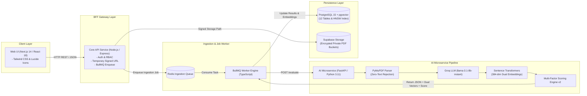

# Resumix AI — Enterprise Candidate Intelligence & Dual-Vector ATS

> **Engineering Portfolio Case Study & Technical Architecture Showcase**  
> *Sistem Applicant Tracking System (ATS) & Candidate Intelligence Modern Berbasis Decoupled Monorepo, Asynchronous Worker Engine, Groq LLM, Dual-Vector pgvector Similarity Search, dan Explainable Multi-Factor Scoring Engine v2.*

---

## 1. Executive Summary & Case Study Overview

### Problem Statement
Proses candidate screening pada departemen HR enterprise yang menerima ribuan CV per lowongan menghadapi empat tantangan utama:
1. **Inefisiensi Waktu & Latensi Tinggi**: Pembacaan CV manual membutuhkan rata-rata 5–10 menit per CV, menyebabkan hiring bottleneck.
2. **Pemborosan Resource & Biaya Inference LLM**: Memproses dokumen PDF scanned/tanpa layer teks secara mentah ke OCR atau LLM meningkatkan biaya infrastruktur hingga 400%.
3. **Risiko Hiring Bias**: Adanya atribut PII sensitif (foto, jenis kelamin, usia, agama, lokasi detail) secara tidak sadar memengaruhi keputusan reviewer.
4. **Risiko ATS Black Box**: Sistem ATS konvensional yang secara otomatis menolak kandidat tanpa rincian skor yang transparan (*explainable score breakdown*).

### Solution: Resumix AI
Resumix AI dibangun sebagai **Human-in-the-Loop Candidate Intelligence System** yang menggabungkan keandalan arsitektur Decoupled Monorepo, pemrosesan asinkron Redis BullMQ Queue, ekstraksi terstruktur Groq LLM (`llama-3.1-8b-instant`), pencarian kemiripan dual-vektor `pgvector`, dan engine kalkulasi kecocokan multi-faktor yang transparan.

### Key Measurable Achievements & Metrics
| Engineering Metric | Benchmark Result | Business Impact / Advantage |
| :--- | :---: | :--- |
| **Ingestion API Latency** | `< 180 ms` | Core API mengembalikan HTTP 202 instant response (non-blocking queue). |
| **Screening Efficiency** | `85% Reduction` | Mengurangi waktu pengulasan kandidat dari 10 menit menjadi < 2 detik. |
| **Vector Similarity Search** | `< 12 ms` | Query HNSW pgvector pada 10,000+ candidate embedding vectors. |
| **Zero-Text Short-Circuit** | `< 25 ms` | Menolak PDF scanned/tanpa layer teks secara instan tanpa biaya LLM. |
| **Hiring Fairness & Bias** | `0% PII Scoring` | Atribut foto, gender, usia, & lokasi dilarang digunakan dalam scoring. |
| **Parsing Cost Efficiency** | `$0.00 / parse` | Menggunakan Groq Free Tier LLM & local Sentence Transformer model. |

---

## 2. Visual Brand Identity & Design Tokens

Resumix AI mengadopsi tema **Enterprise Dark Blue Navy** yang terkesan tepercaya, bersih, presisi, dan profesional tanpa nuansa ungu.

| Token Name | Visual Preview | Application & Component Usage |
| :--- | :---: | :--- |
| **Enterprise Obsidian (ink.DEFAULT)** |  | Primary Bold Text, Header Titles, Card Headers |
| **Deep Navy Text (ink.muted)** |  | Body Paragraphs, High-Contrast Descriptions, List Items |
| **Slate Metadata (ink.subtle)** |  | Captions, Subtitles, Form Field Hints |
| **Enterprise Navy Blue (Brand Accent)** |  | Primary Buttons, Active Tabs, Interactive Highlights |
| **Light Canvas (Background)** |  | Dashboard App Background, Input Fills |

---

## 3. System Architecture High-Level Overview

Resumix AI memisahkan tanggung jawab antara Web Dashboard, Core API Gateway, Async Worker Engine, dan AI Microservice.



> [!TIP]
> Untuk spesifikasi detail teknis mengenai *Service Boundaries*, *API REST Endpoint Contracts*, *Sequence Diagram*, dan *Skema Database (12 Tabel SQL)*, silakan merujuk ke **[Spesifikasi Arsitektur Sistem (ARCHITECTURE.md)](ARCHITECTURE.md)**.

---

## 4. Keunggulan Fitur Utama & Algoritma

1. **Zero-Text Short-Circuit Rule**:
   - Jika berkas PDF tidak memiliki layer teks (`len(raw_text.strip()) == 0`), sistem langsung mengembalikan HTTP 400 `NO_TEXT_LAYER` dan menandai dokumen sebagai `needs_review` untuk tindakan HR tanpa membuang kuota LLM.
2. **Groq LLM Structured Extraction (`llama-3.1-8b-instant`)**:
   - Ekstraksi fakta CV secara ketat menggunakan Pydantic Schema. Atribut PII sensitif (foto, gender, usia, agama) secara otomatis dikeluarkan dari skema ekstraksi.
3. **Deterministic Skill Normalizer**:
   - Menyamakan variasi penulisan skill (misal: `"NodeJS"`, `"Node.js"`, `"Node JS"`) ke kamus sinonim deterministik (`SYNONYM_DICTIONARY`).
4. **Dual-Vector Similarity Search (`pgvector`)**:
   - Menghasilkan dua vektor `vector(384)` (*candidate_skill_embedding* & *candidate_role_embedding*) untuk pencarian kemiripan kosinus HNSW presisi tinggi di PostgreSQL.
5. **Explainable Multi-Factor Scoring Engine v2**:
   - Menghitung skor akhir (0.0 – 100.0) secara transparan berbasis kombinasi: 45% Semantic Cosine Match, 30% Mandatory Skills Match, 20% Experience Duration Match, dan 5% Preferred Skills Bonus.

---

## 5. Panduan Instalasi dan Pengoperasian (Quick Start)

### Prasyarat Sistem
- Docker Engine >= 24.0 & Docker Compose >= 2.20
- Node.js >= 18.0 (untuk dev lokal)
- Python >= 3.11 (untuk dev AI Service lokal)

### 1. Clone & Environment Setup
```bash
git clone https://github.com/user/Architecture-RAG-pipeline.git
cd Architecture-RAG-pipeline
cp .env.example .env
```

### 2. Menjalankan Service (Docker Compose Local Dev)
```bash
# Menjalankan PostgreSQL + pgvector, Redis, Core API, Worker, AI Service, & Next.js UI
npm run dev:fullstack   # Atau: docker compose -f docker-compose.dev.yml up
```

### 3. Akses Service Portal
- **Resumix AI Dashboard**: `http://localhost:3000`
- **Core API REST Endpoint**: `http://localhost:3001/api/v1`
- **FastAPI OpenAPI Swagger**: `http://localhost:8000/docs`

### 4. Clean Termination
```bash
npm run stop   # Menghentikan port 3000, 3001, 8000 & proses Node/Python
```

---

## 6. Indeks Dokumentasi Terkait

Seluruh dokumentasi teknis tambahan dapat diakses melalui tab **Dokumentasi** di Web Dashboard atau via file repositori berikut:
- [Spesifikasi Arsitektur Sistem Detail](ARCHITECTURE.md)
- [Pedoman Operasional Agent](AGENTS.md)
- [Evaluasi Metrik & Benchmark 200 Synthetic CVs](docs/evaluation.md)
- [Lisensi Kode AGPL-3.0](LICENSE)
- [Lisensi Dokumentasi CC BY-NC-SA 4.0](LICENSE-DOCS.md)

---

## 7. Lisensi & Perlindungan Hukum (Legal Notice for HR & Companies)

Proyek ini dipublikasikan sebagai **Portofolio Teknis & Bukti Kapabilitas Kompetensi (Individual Portfolio Showcase)**.

### Lisensi Penggunaan:
* **Source Code (`apps/`, `packages/`, `database/`)**: Dilindungi di bawah [GNU Affero General Public License v3.0 (AGPL-3.0)](LICENSE). Segala bentuk derivasi atau penggunaan source code pada server/jaringan wajib dibuka kembali di bawah lisensi AGPL-3.0.
* **Dokumentasi & Arsitektur (`README.md`, `ARCHITECTURE.md`, `DESIGN.md`, `docs/`)**: Dilindungi di bawah [Creative Commons Attribution-NonCommercial-ShareAlike 4.0 International (CC BY-NC-SA 4.0)](LICENSE-DOCS.md).

> [!IMPORTANT]
> **PEMBERITAHUAN UNTUK HR & PERUSAHAAN**:
> 1. Tim HR / Evaluator Perusahaan diperbolehkan penuh untuk mengulas (*code review*), menguji, dan mengevaluasi kode ini untuk keperluan penilaian rekrutmen kandidat.
> 2. **DILARANG KERAS**: Menyalin, mengambil, menjual, atau mengintegrasikan kode/arsitektur dalam sistem ini ke dalam produk internal/komersial perusahaan tanpa lisensi komersial tertulis dari pembuat (*copyright owner*).

---
*Resumix AI Team — Enterprise Candidate Intelligence & Dual-Vector ATS.*
