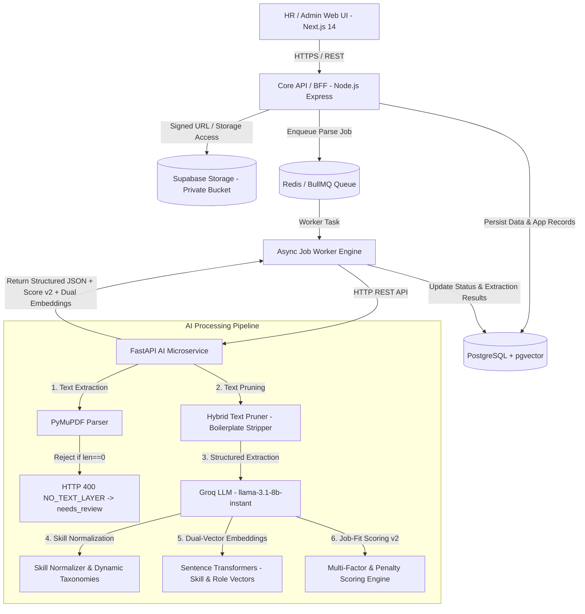

# CV ATS Pipeline - Enterprise Candidate Screening System

Sistem Applicant Tracking System (ATS) modern berbasis arsitektur mikroservis terpisah (*decoupled monorepo*) yang dirancang untuk pengolahan CV kandidat secara otomatis. Sistem ini menggabungkan ekstraksi teks PDF berbasis PyMuPDF, penolakan ketat PDF tanpa layer teks (*zero-text rejection rule*), pemangkasan teks noise/boilerplate berbasis *Hybrid Text Pruner*, ekstraksi terstruktur berbantuan LLM (Groq `llama-3.1-8b-instant`) dengan skema Pydantic, normalisasi skill deterministik & taksonomi dinamis, pencarian dual-vektor via `pgvector`, serta engine perhitungan *job-fit score* v2 (Dual-Vector & Multi-Factor Scoring) yang transparan dan dapat diaudit.

---

## 1. Overview dan Prinsip Perancangan

CV ATS Pipeline dirancang khusus sebagai **decision-support tool** bagi tim HR / Recruiter, bukan sebagai mesin penentu keputusan rekrutmen otomatis. 

### Prinsip Utama Sistem
- **Human-in-the-Loop**: AI tidak pernah membuat keputusan penolakan (`rejected`) atau penerimaan (`hired`) kandidat secara independen. Sistem menyediakan skor kecocokan beserta rincian alasannya (*score breakdown*) agar HR dapat membuat keputusan yang terukur.
- **Asynchronous & Real-Time Processing**: Pemrosesan dokumen CV dalam jumlah besar dilakukan secara asinkron menggunakan antrean (*job queue* BullMQ & Redis) untuk memberikan respons API di bawah 200 ms. Sistem juga menyediakan endpoint *Instant Synchronous Evaluation* untuk pengujian real-time.
- **Keamanan Data dan Privasi (PII)**: Berkas CV disimpan dalam penyimpanan objek privat (*private object storage* Supabase). Akses berkas oleh pengguna dilakukan melalui *Temporary Signed URL* berjangka waktu singkat (TTL 300 detik).
- **Scoring Fairness**: Proses penilaian kecocokan (*job-fit scoring*) murni didasarkan pada kompetensi teknis, kualifikasi skill wajib, dan durasi pengalaman kerja yang relevan. Atribut sensitif seperti foto, usia, jenis kelamin, agama, lokasi detail, atau status pernikahan dilarang digunakan dalam scoring.

---

## 2. Arsitektur Sistem dan Batas Layanan

Sistem mengadopsi pola arsitektur **Decoupled Monorepo** yang memisahkan tanggung jawab antara *Web Dashboard*, *Core API / BFF*, *Job Worker*, dan *AI Microservice*.



### Tabel Batas Layanan (Service Boundaries)

| Layanan / Komponen | Tanggung Jawab Utama | Hal yang Dilarang |
| :--- | :--- | :--- |
| **Frontend (`apps/web`)** | UI/UX HR, form lowongan kerja, import lowongan LinkedIn/Glints, upload dropzone CV, visualisasi status proses BullMQ, dual-layout pipeline (**Table** & **Kanban Board**), **Candidate Comparator Matrix** *side-by-side*, preview PDF, dan form review/edit hasil AI. | Memegang API key/secret internal, menghitung skor otoritatif, atau melakukan query langsung ke database. |
| **Core API (`apps/api`)** | Auth/RBAC, manajemen domain (Jobs CRUD, Import LinkedIn, Candidates, Applications), enkapsulasi signed URL storage, real-time instant evaluation, pencarian vektor pgvector, dan orkestrasi BullMQ queue. | Melakukan parsing PDF atau pemanggilan LLM langsung di dalam request handler HTTP sinkron standar. |
| **Job Worker (`apps/api/src/worker`)** | Mengambil job dari Redis Queue, mengelola mekanisme retry, memanggil FastAPI AI Microservice, dan mengonfirmasi pembaruan status DB. | Menentukan keputusan rekrutmen kandidat secara otomatis tanpa pengawasan HR. |
| **AI Service (`apps/ai-service`)** | Parsing PDF (PyMuPDF), zero-text rejection, text pruner, ekstraksi terstruktur Groq LLM (`llama-3.1-8b-instant`), validasi Pydantic, normalisasi skill & taksonomi dinamis, pembuatan dual-embedding (Skill & Role vector), dan kalkulasi scoring v2. | Menulis atau mengubah data langsung ke PostgreSQL tanpa melalui kontrak API/Worker. |
| **PostgreSQL + `pgvector`** | Menyimpan data relasional ternormalisasi (13 tabel, 3 migrasi SQL), indeks pencarian dual-vektor kemiripan (`candidate_skill_embedding` & `candidate_role_embedding`), audit log, dan tracking status pekerjaan. | Menyimpan berkas biner PDF CV secara langsung di dalam kolom tabel. |
| **Storage (`Supabase Storage`)** | Menyimpan berkas CV asli secara privat dalam struktur terisolasi. | Menjadikan bucket berstatus publik tanpa proteksi signed URL. |

---

## 3. Alur Kerja Ingestion dan Pemrosesan

### A. Pemrosesan Asinkron (High-Volume Queue)
```text
1. HR / Kandidat Mengunggah CV PDF via Web UI
   └─> Core API memvalidasi MIME type (application/pdf), ukuran berkas (maksimal 10 MB).
   └─> Berkas disimpan ke Supabase Storage private bucket (cv-files/raw/{document_id}.pdf).
   └─> Record 'applications' dibuat (status: 'applied').
   └─> Record 'candidate_documents' dibuat (parse_status: 'uploaded').
   └─> Job pemrosesan dimasukkan ke Redis Queue (processing_jobs status 'queued').
   └─> Core API mengembalikan respon HTTP 202 Accepted (< 200 ms) berisi application_id, document_id, & processing_job_id.

2. Pemrosesan Asinkron oleh Worker Engine
   └─> Worker mengambil job dari queue dan memperbarui parse_status menjadi 'processing'.
   └─> Worker memanggil FastAPI AI Service (/v1/cv/extract-text, /v1/cv/llm-extract, dll).
   └─> PyMuPDF mengeksekusi ekstraksi teks PDF. Jika len == 0, melempar HTTP 400 NO_TEXT_LAYER -> status 'needs_review'.
   └─> Hybrid Text Pruner membersihkan boilerplate noise & menyaring seksi kualifikasi utama.
   └─> Teks pruner dikirim ke Groq LLM (llama-3.1-8b-instant) sesuai skema Pydantic.
   └─> Skill diekstrak dan dicocokkan via kamus sinonim deterministik & tabel skill_taxonomies.
   └─> Model Sentence Transformers menghasilkan dual 384-dim embeddings (Skill Vector & Role Vector).
   └─> Scoring Engine v2 menghitung nilai kecocokan (0-100) dan Mandatory Skill Penalty Factor.
   └─> Worker menyimpan parsed_cv_json, candidate_skills, dual embeddings, dan score_breakdown ke PostgreSQL.
   └─> Worker mengubah parse_status menjadi 'processed' (atau 'needs_review' / 'failed').
```

### B. Evaluasi Real-Time Instant (Synchronous Pipeline)
Untuk pengujian atau preview instan, API menyediakan endpoint `POST /api/v1/jobs/:jobId/evaluate-instant` yang menjalankan eksekusi pipeline lengkap secara sinkron dan mengembalikan hasil parsing, skill ter-normalisasi, serta breakdown skor v2 dalam satu respons HTTP.

---

## 4. Struktur Repository Monorepo

```text
cv-ats-pipeline/
├── apps/
│   ├── web/                         # Next.js 14 HR Dashboard (TypeScript + Tailwind CSS)
│   ├── api/                         # Node.js / Express Core API & BullMQ Worker Engine
│   │   └── src/
│   │       ├── index.ts             # Express REST Routes & API Entry Point
│   │       ├── services/            # DB, Job, AI Client, & Job Import services
│   │       └── worker/              # BullMQ Async CV Processing Worker
│   └── ai-service/                  # FastAPI Python AI Microservice
│       ├── app/
│       │   ├── main.py              # FastAPI Endpoints & Health Check
│       │   ├── schemas/
│       │   │   └── cv_schema.py     # Pydantic Schemas & DTO Definitions
│       │   └── services/
│       │       ├── pdf_extractor.py        # PyMuPDF Parser & Zero-Text Rejection Rule
│       │       ├── text_pruner.py          # Hybrid Noise & Boilerplate Text Pruner
│       │       ├── llm_provider.py         # Groq LLM Structured Extraction (llama-3.1-8b-instant)
│       │       ├── job_extractor.py        # Job Posting Qualification Extractor
│       │       ├── skill_normalizer.py     # Skill Synonym Dictionary & Dynamic Taxonomies
│       │       ├── embedding_service.py    # Dual-Vector (Skill & Role) 384-dim Embeddings
│       │       ├── experience_calculator.py# Relevant Domain Experience Month Calculator
│       │       └── scoring_service.py      # Multi-Factor & Penalty Scoring Engine (v2)
│       └── models/                  # Local Cache Directory for SentenceTransformer models
├── packages/
│   ├── contracts/                   # Shared DTOs, OpenAPI Specs, & JSON Schemas
│   └── config/                      # Shared TSConfig, ESLint, & Prettier rules
├── database/
│   ├── migrations/                  # PostgreSQL SQL Migrations
│   │   ├── 001_initial_schema.sql           # Core 12 Relational Tables & Enums
│   │   ├── 002_dual_vector_embeddings.sql   # Dual-Vector Embedding Columns & Match Procedure
│   │   └── 003_skill_taxonomies.sql         # Dynamic Custom Skill Synonym Table
│   ├── seeds/                       # Seed data untuk pengujian & pengembangan lokal
│   └── functions/                   # Custom SQL functions & match_candidates_for_job procedure
├── docs/                            # Dokumentasi Spesifikasi & Arsitektur Moduler
│   ├── architecture.md              # Spesifikasi Arsitektur Utama & System Boundaries
│   ├── brainstorming-rag-pipeline.md# Dokumen Analisis & Rencana Pengembangan Pipeline
│   ├── front-end-pipeline.md        # Spesifikasi UI/UX, Component Tree, & Design Token
│   ├── api.md                       # Dokumentasi Kontrak REST API v1
│   ├── scoring.md                   # Formulasi Matrik & Spesifikasi Scoring Hybrid
│   ├── security.md                  # Keamanan, PII, RBAC, & Retensi Data
│   └── evaluation.md                # Evaluasi Kualitas AI, Corpus Test, & Target Metrik
├── infra/
│   ├── docker/                      # Multi-stage Dockerfile untuk tiap mikroservis
│   └── scripts/                     # Script automasi migrasi & pengujian
├── docker-compose.yml               # Kontainerisasi Produksi
├── docker-compose.dev.yml           # Kontainerisasi Pengembangan Lokal (Hot-Reload)
├── .env.example                     # Template Variabel Lingkungan
├── AGENTS.md                        # Panduan Operasional & Aturan AI Agent
├── ARCHITECTURE.md                  # Master Architecture Specification
└── README.md                        # Master Dokumen Portofolio Utama
```

---

## 5. Pipeline Pemrosesan AI dan LLM Extraction

### A. Ekstraksi Teks PDF dan Zero-Text Rejection Rule

Ekstraksi awal menggunakan PyMuPDF karena latensinya yang sangat rendah (< 1 detik). Untuk mengoptimalkan efisiensi sumber daya dan kecepatan pemrosesan, sistem tidak menggunakan fallback OCR. Jika PDF terdeteksi berupa gambar/scan tanpa layer teks (`len(raw_text.strip()) == 0`), sistem langsung menghentikan pipeline dengan error `NO_TEXT_LAYER` (HTTP 400) dan menandai status dokumen sebagai `needs_review` untuk tindakan tim HR.

Aturan penolakan teks diimplementasikan dalam Python sebagai berikut:

```python
if len(raw_text.strip()) == 0:
    raise ValueError("NO_TEXT_LAYER: Berkas PDF tidak memiliki layer teks yang dapat dibaca. Harap unggah PDF asli berbasis teks.")
```

---

### B. Pemangkasan Teks Hybrid (Hybrid Text Pruner)

Sebelum teks mentah dikirim ke LLM atau embedder, modul `text_pruner.py` melakukan pembersihan boilerplate noise seperti EEO disclaimers, bagian *How to Apply*, daftar fasilitas/perks kantor umum, dan *navigation crumbs*. Setelah itu, modul secara cerdas mengekstrak seksi kualifikasi utama (*Technical Skills*, *Key Responsibilities*, *Requirements*, *Qualifications*, *About The Role*).

Proses ini menghemat penggunaan token LLM sebesar **30% hingga 50%** tanpa mengurangi sinyal pencocokan teknis kandidat.

---

### C. Structured Extraction dengan Pydantic Schema

Data hasil ekstraksi dibentuk ke dalam struktur Pydantic ter-tipe kuat (`cv_schema.py`) untuk menjamin keabsahan tipe data sebelum disimpan ke database:

```python
from datetime import date
from typing import Literal
from pydantic import BaseModel, Field

class ExtractionEvidence(BaseModel):
    source_text: str | None = None
    confidence: float | None = Field(default=None, ge=0, le=1)

class Contact(BaseModel):
    email: str | None = Field(default=None, description="Candidate email address")
    phone_number: str | None = None
    linkedin_url: str | None = None
    portfolio_url: str | None = None
    location: str | None = None

class Skill(BaseModel):
    name: str
    normalized_name: str | None = None
    category: Literal[
        "programming_language",
        "framework",
        "database",
        "cloud",
        "tool",
        "soft_skill",
        "other"
    ] = "other"
    confidence: float | None = Field(default=1.0, ge=0, le=1)
    evidence: ExtractionEvidence | None = None

class WorkExperience(BaseModel):
    company: str | None = None
    role: str | None = None
    start_date: date | None = None
    end_date: date | None = None
    is_current: bool = False
    duration_months: int | None = Field(default=None, ge=0)
    description: str | None = None
    skills_used: list[str] = Field(default_factory=list)

class Education(BaseModel):
    institution: str | None = None
    degree: str | None = None
    major: str | None = None
    start_year: int | None = None
    end_year: int | None = None

class Portfolio(BaseModel):
    title: str
    url: str | None = None
    description: str | None = None

class Reference(BaseModel):
    name: str
    role: str | None = None
    company: str | None = None
    contact_info: str | None = None

class CVExtraction(BaseModel):
    full_name: str | None = None
    contact: Contact = Field(default_factory=Contact)
    summary: str | None = None
    skills: list[Skill] = Field(default_factory=list)
    work_experience: list[WorkExperience] = Field(default_factory=list)
    education: list[Education] = Field(default_factory=list)
    certifications: list[str] = Field(default_factory=list)
    projects: list[str] = Field(default_factory=list)
    portfolios: list[Portfolio] = Field(default_factory=list)
    references: list[Reference] = Field(default_factory=list)
    total_experience_months: int | None = Field(default=None, ge=0)
    extraction_warnings: list[str] = Field(default_factory=list)
```

---

### D. Aturan Prompt Engineering dan Anti-Halusinasi

Instruksi sistem (*System Prompt*) dirancang secara eksplisit untuk mencegah halusinasi data:

```text
Anda adalah mesin ekstraksi data CV kandidat untuk sistem ATS enterprise.

Aturan Wajib:
1. Ekstrak HANYA fakta yang tertulis secara eksplisit pada teks CV.
2. Dilarang menyimpulkan tingkat senioritas, keahlian tambahan, atau kualifikasi yang tidak tertera.
3. Gunakan nilai null untuk objek/skalar dan [] untuk daftar jika data tidak ditemukan.
4. Dilarang menambahkan kunci (keys) di luar skema JSON yang ditentukan.
5. Hitung durasi kerja hanya dari rentang tanggal yang eksplisit. Jika tanggal ambigu, isi duration_months sebagai null dan tambahkan pesan peringatan pada extraction_warnings.
6. Keluarkan JSON murni yang mematuhi skema tanpa penjelasan naratif atau format markdown codeblock.
```

---

### E. Normalisasi Skill Deterministik dan Taksonomi Dinamis

Skill yang diekstrak diaudit melalui dua lapisan normalisasi:
1. **Static Synonym Dictionary (`SYNONYM_DICTIONARY`)**: Kamus sinonim bawaan untuk domain Backend, Frontend, Database, DevOps, dan AI.
2. **Dynamic Skill Taxonomies (`skill_taxonomies` table & API)**: Tabel database dan endpoint API (`POST /v1/skills/taxonomies`) yang memungkinkan admin HR menambah atau memperbarui sinonim skill domain khusus saat runtime.

---

### F. Dual-Vector Embedding Architecture (Skill & Role Vectors)

Sistem menggunakan dua vektor terpisah berdimensi 384 berbasis model `sentence-transformers/paraphrase-multilingual-MiniLM-L12-v2`:
- **`candidate_skill_embedding` / `job_skill_embedding`**: Vektor yang berfokus pada daftar kompetensi teknis dan keahlian kandidat/lowongan.
- **`candidate_role_embedding` / `job_role_embedding`**: Vektor yang berfokus pada tanggung jawab posisi, riwayat pengalaman kerja, dan ringkasan eksekutif kandidat/lowongan.

---

### G. Engine Perhitungan Job-Fit Score (Version v2 Formula)

Engine scoring versi `v2` menggunakan pendekatan **Multi-Factor Weighted Scoring** dikombinasikan dengan **Strict Mandatory Skill Penalty Factor**:

#### 1. Skor Mentah Terbobot (Raw Score)
$$\text{Raw Score} = 100 \times \left( 0.25 S_{\text{skill\_sem}} + 0.20 S_{\text{role\_sem}} + 0.30 S_{\text{mandatory}} + 0.20 S_{\text{experience}} + 0.05 S_{\text{preferred}} \right)$$

Dimana:
- $S_{\text{skill\_sem}}$: Kemiripan kosinus antara `candidate_skill_embedding` dan `job_skill_embedding` (0.0–1.0).
- $S_{\text{role\_sem}}$: Kemiripan kosinus antara `candidate_role_embedding` dan `job_role_embedding` (0.0–1.0).
- $S_{\text{mandatory}}$: Rasio pemenuhan skill wajib kandidat terhadap total skill wajib lowongan.
- $S_{\text{experience}}$: Rasio durasi pengalaman domain relevan kandidat ($M_{\text{relevant}}$) terhadap batas minimum lowongan ($M_{\text{minimum}}$):
  $$S_{\text{experience}} = \min\left(1.0, \frac{M_{\text{relevant}}}{M_{\text{minimum}}}\right)$$
- $S_{\text{preferred}}$: Rasio pemenuhan skill opsional/tambahan.

#### 2. Mandatory Skill Strict Penalty Factor ($P_{\text{mandatory}}$)
Jika kandidat kehilangan skill wajib (*mandatory skills*), skor mentah dikalikan dengan faktor penalti:
- **0 skill wajib hilang**: $P_{\text{mandatory}} = 1.00$ (Tidak ada diskon / 100%)
- **1 skill wajib hilang**: $P_{\text{mandatory}} = 0.75$ (Diskon 25%)
- **2 skill wajib hilang**: $P_{\text{mandatory}} = 0.50$ (Diskon 50%)
- **3+ skill wajib hilang**: $P_{\text{mandatory}} = 0.25$ (Diskon 75%)

#### 3. Skor Akhir Terkalkulasi (Final Score)
$$\text{Final Score} = \text{round}\left( \max\left(0.0, \min\left(100.0, \text{Raw Score} \times P_{\text{mandatory}}\right)\right), 1 \right)$$

#### Output Breakdown JSON (Version v2)
```json
{
  "score_version": "v2",
  "semantic_similarity": 0.82,
  "semantic_weight": 0.45,
  "skill_semantic_similarity": 0.85,
  "skill_semantic_weight": 0.25,
  "role_semantic_similarity": 0.78,
  "role_semantic_weight": 0.20,
  "mandatory_skill_score": 0.75,
  "mandatory_skill_weight": 0.30,
  "experience_score": 1.00,
  "experience_weight": 0.20,
  "relevant_experience_months": 36,
  "preferred_skill_score": 0.60,
  "preferred_skill_weight": 0.05,
  "mandatory_penalty_factor": 0.75,
  "final_score": 62.4,
  "matched_skills": ["Python", "PostgreSQL", "Docker"],
  "missing_mandatory_skills": ["Kubernetes"]
}
```

---

### H. Dual-Vector Search dan Discovery dengan `pgvector`

Pencarian kemiripan kandidat dilakukan melalui *Stored Procedure* PostgreSQL `match_candidates_for_job`:

```sql
SELECT
  c.id AS candidate_id,
  c.full_name,
  c.email,
  c.total_experience_months,
  (1 - (c.candidate_skill_embedding <=> j.job_skill_embedding)) AS skill_similarity,
  (1 - (c.candidate_role_embedding <=> j.job_role_embedding)) AS role_similarity,
  (
    0.55 * (1 - (c.candidate_skill_embedding <=> j.job_skill_embedding)) +
    0.45 * (1 - (c.candidate_role_embedding <=> j.job_role_embedding))
  ) AS semantic_similarity
FROM candidates c
INNER JOIN job_postings j ON j.id = :job_id
ORDER BY semantic_similarity DESC
LIMIT 20;
```

---

## 6. Rancangan Model Data (Database Schema)

Sistem menggunakan database PostgreSQL dengan **13 tabel utama** yang terbagi ke dalam 3 berkas migrasi SQL:

- `001_initial_schema.sql`: Memuat tabel `users`, `candidates`, `candidate_documents`, `candidate_skills`, `candidate_experiences`, `candidate_educations`, `job_postings`, `job_required_skills`, `applications`, `processing_jobs`, `score_versions`, dan `audit_logs`.
- `002_dual_vector_embeddings.sql`: Menambahkan kolom dual-vector (`candidate_skill_embedding`, `candidate_role_embedding`, `job_skill_embedding`, `job_role_embedding`) dan stored procedure `match_candidates_for_job`.
- `003_skill_taxonomies.sql`: Menambahkan tabel `skill_taxonomies` untuk penyimpanan sinonim skill dinamis.

```text
users (HR / Admin)
  └── job_postings (termasuk job_skill_embedding & job_role_embedding)
         ├── job_required_skills
         └── applications ─────── candidates (termasuk candidate_skill_embedding & candidate_role_embedding)
                                    ├── candidate_documents
                                    ├── candidate_skills
                                    ├── candidate_experiences
                                    └── candidate_educations
processing_jobs (Queue Audit)
score_versions (Scoring Config)
audit_logs (Security Audit)
skill_taxonomies (Dynamic Skill Synonyms)
```

---

## 7. Spesifikasi dan Kontrak API v1

Seluruh endpoint REST API diakses melalui prefix `/api/v1`.

### Ringkasan Endpoint Utama

| Method | Endpoint Path | Deskripsi |
| :--- | :--- | :--- |
| **POST** | `/api/v1/jobs` | Membuat lowongan kerja baru beserta kriteria skill wajib/opsional & membuat vector embedding otomatis. |
| **POST** | `/api/v1/jobs/import-linkedin` | Melakukan parsing teks deskripsi lowongan LinkedIn/Glints via Groq LLM & membuat lowongan otomatis. |
| **GET** | `/api/v1/jobs` | Mengambil daftar lowongan kerja. |
| **DELETE** | `/api/v1/jobs/:jobId` | Menghapus lowongan kerja beserta seluruh data kandidat terkait. |
| **POST** | `/api/v1/jobs/:jobId/applications` | Mengunggah CV kandidat secara asinkron (mengembalikan HTTP 202 Accepted dalam `< 200 ms`). |
| **POST** | `/api/v1/jobs/:jobId/evaluate-instant` | Melakukan evaluasi pencocokan CV secara real-time sinkron (untuk preview instan). |
| **GET** | `/api/v1/jobs/:jobId/candidates/match` | Menjalankan pencarian kemiripan kandidat berbasis dual-vector `pgvector`. |
| **GET** | `/api/v1/jobs/:jobId/applications` | Mengambil daftar aplikasi kandidat pada lowongan kerja spesifik. |
| **PATCH** | `/api/v1/applications/:applicationId/status` | Memperbarui tahap rekrutmen kandidat (`screening`, `interview`, `hired`, `rejected`, dll). |
| **GET** | `/api/v1/processing-jobs/:processingJobId` | Melakukan polling status pemrosesan dokumen CV dalam antrean. |
| **POST** | `/api/v1/cv/embedding` | Meminta pembuatan vector embedding 384 dimensi dari teks atau JSON CV. |

### Endpoint AI Microservice Direct (`apps/ai-service`)

| Method | Endpoint Path | Deskripsi |
| :--- | :--- | :--- |
| **GET** | `/health` | Status kesehatan AI microservice & koneksi Groq API. |
| **POST** | `/v1/cv/extract-text` | Ekstraksi teks PDF PyMuPDF & pemeliharaan zero-text rejection rule. |
| **POST** | `/v1/cv/llm-extract` | Ekstraksi terstruktur Groq LLM (`llama-3.1-8b-instant`) sesuai skema Pydantic. |
| **POST** | `/v1/cv/normalize-skills` | Normalisasi skill deterministik via kamus sinonim. |
| **POST** | `/v1/cv/generate-embedding` | Pembuatan dual 384-dim embeddings (Skill Vector & Role Vector). |
| **POST** | `/v1/cv/calculate-score` | Perhitungan *job-fit score* v2 dan pembentukan breakdown JSON. |
| **POST** | `/v1/job/extract-qualifications` | Parsing kualifikasi teks deskripsi lowongan kerja via LLM. |
| **GET** | `/v1/skills/taxonomies` | Mengambil seluruh peta sinonim taksonomi skill statis & dinamis. |
| **POST** | `/v1/skills/taxonomies` | Mendaftarkan sinonim taksonomi skill dinamis baru saat runtime. |

---

## 8. Keamanan Data, Privasi (PII), dan Tata Kelola

- **Private Object Storage & Temporary Signed URL**: Berkas PDF CV disimpan pada Supabase Storage berstatus privat. Pengguna web UI hanya mendapatkan akses baca berkas melalui Signed URL dengan waktu kedaluwarsa singkat (TTL 300 detik).
- **Role-Based Access Control (RBAC)**: Pembatasan hak akses bertingkat (`admin`, `hr_recruiter`, `hiring_manager`, `viewer`) untuk mengakses dokumen CV dan memperbarui status kandidat.
- **Redaksi PII pada Logging**: Sistem melarang pencetakan isi teks mentah CV, nomor telepon, alamat email, atau API key pada log aplikasi atau platform observabilitas.
- **Perlindungan Ingestion Berkas**: Validasi ketat terhadap header berkas (magic bytes), batas ukuran maksimal 10 MB, pembatasan jumlah halaman maksimal 10 halaman, dan penolakan PDF terenkripsi/password.
- **Audit Logging**: Setiap aksi krusial (pembacaan berkas CV, pembaruan status aplikasi, perbaikan data kandidat, dan pemicu pemrosesan ulang) dicatat pada tabel `audit_logs`.

---

## 9. Metrik Evaluasi Kualitas AI

Pipeline AI diuji secara berkala menggunakan *CV Test Corpus* anonim untuk memastikan keandalan hasil ekstraksi:

| Metrik Evaluasi | Formula / Definisi | Target Minimal |
| :--- | :--- | :--- |
| **JSON Validity Rate** | Rasio keluaran LLM yang mematuhi skema Pydantic tanpa error sintaks. | $\ge 98\%$ |
| **Contact Extraction Accuracy** | Akurasi ekstraksi field email dan nomor telepon terhadap data acuan (*ground truth*). | $\ge 98\%$ |
| **Skill Extraction F1-Score** | *Harmonic mean* dari presisi dan recall ekstraksi skill kandidat. | $\ge 0.80$ |
| **Digital PDF Latency** | Waktu pemrosesan total untuk PDF berbasis teks digital. | $< 10\text{ detik}$ |
| **Textless Rejection Latency** | Waktu deteksi dan penolakan PDF scanned/tanpa layer teks. | $< 0.5\text{ detik}$ |
| **Manual Correction Rate** | Persentase data hasil ekstraksi yang memerlukan koreksi manual oleh HR. | $< 20\%$ |

Dokumentasi detail mengenai corpus pengujian dapat diakses pada [docs/evaluation.md](docs/evaluation.md).

---

## 10. Panduan Instalasi dan Pengoperasian (Quick Start)

### Prasyarat Sistem
- Docker Engine $\ge 24.0$ & Docker Compose $\ge 2.20$
- Node.js $\ge 18.0$ (untuk pengembangan lokal tanpa kontainer)
- Python $\ge 3.11$ (untuk pengembangan AI Service lokal)

### 1. Kloning Repository dan Konfigurasi Environment
```bash
git clone https://github.com/user/cv-ats-pipeline.git
cd cv-ats-pipeline
cp .env.example .env
```

### 2. Menjalankan Lingkungan Pengembangan (Local Dev)
Gunakan `docker-compose.dev.yml` untuk menjalankan seluruh dependensi (PostgreSQL, Redis, Core API, AI Service, dan Web UI) dengan fitur *hot-reload*:

```bash
docker compose -f docker-compose.dev.yml up --build
```

### 3. Akses Layanan Lokal
- **HR Web Dashboard**: `http://localhost:3000`
- **Core REST API v1**: `http://localhost:3001/api/v1`
- **FastAPI OpenAPI Docs**: `http://localhost:8000/docs`

---

## 11. Indeks Dokumentasi Lanjutan

Untuk informasi teknis yang lebih terperinci, silakan merujuk pada dokumen di folder `docs/`:

- [Spesifikasi Arsitektur Sistem](docs/architecture.md)
- [Dokumen Analisis & Brainstorming Pipeline RAG/ATS](docs/brainstorming-rag-pipeline.md)
- [Spesifikasi Front-End & Desain UX](docs/front-end-pipeline.md)
- [Spesifikasi Kontrak REST API v1](docs/api.md)
- [Formulasi & Spesifikasi Job-Fit Scoring](docs/scoring.md)
- [Kebijakan Keamanan Data, PII, & RBAC](docs/security.md)
- [Laporan Evaluasi Metrik & Corpus AI](docs/evaluation.md)
