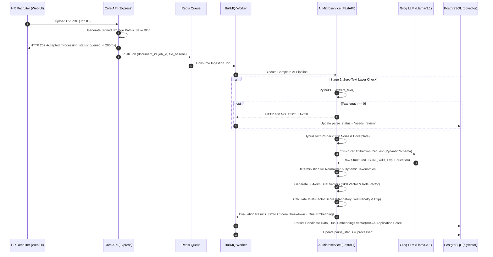

# Architecture Specification: Resumix AI

## 1. System Topology & Architecture Overview

Resumix AI is engineered using a **Decoupled Microservices / Monorepo** architecture designed as a *decision-support system* for enterprise HR teams (rather than an automated decision maker). The system is deployed as a **Managed Private Enterprise Platform** operated exclusively by the Maintainer.

```mermaid
graph TD
    User[HR / Admin Web UI (Private SaaS)] -->|HTTPS / REST| API[Node.js Core API Gateway - Port 3000 / 3001]
    API -->|Signed URL / Private Upload| Storage[(Cloudflare R2 Storage Private Bucket)]
    API -->|Persist Data & Metadata| DB[(PostgreSQL 15 + pgvector)]
    API -->|Enqueue Ingestion Job| Queue[(Redis 7 / BullMQ Queue)]
    Queue -->|Worker Task| Worker[Async Job Worker]
    Worker -->|HTTP REST| AIService[FastAPI AI Microservice - Port 8000]
    API -->|Direct Evaluation / Import| AIService
    
    subgraph AI Processing Microservice Pipeline
        AIService -->|1. /v1/cv/extract-text| PyMuPDF[PyMuPDF Text Extractor]
        PyMuPDF -->|Reject if len==0| Reject[HTTP 400 NO_TEXT_LAYER -> needs_review]
        AIService -->|2. /v1/cv/llm-extract| LLM[Groq LLM - llama-3.1-8b-instant]
        AIService -->|3. /v1/cv/normalize-skills| Normalizer[Skill Synonym Taxonomy]
        AIService -->|4. /v1/cv/generate-embedding| Embedder[SentenceTransformers - 384 dim Dual-Vector]
        AIService -->|5. /v1/cv/calculate-score| Scoring[Deterministic Scoring Engine]
    end

    AIService -->|Return Structured JSON + Dual Vectors + Score| Worker
    Worker -->|Save Candidate Profile & Embeddings| DB
```

---

## 2. Service Boundaries & Responsibilities

| Service             | Components & Technology Stack                             | Key Responsibilities                                                                                                                                            | Anti-Patterns & Prohibited Practices                                                     |
|:--------------------|:----------------------------------------------------------|:----------------------------------------------------------------------------------------------------------------------------------------------------------------|:-----------------------------------------------------------------------------------------|
| **Frontend**        | `apps/web`<br>(Next.js 14, TypeScript, Tailwind CSS)      | HR recruitment dashboard UI, vacancy management, PDF dropzone upload, application status tracking, secure PDF preview via signed URLs, AI score visualizer.     | Storing secrets, calculating authoritative scores, issuing direct DB queries.           |
| **Core API**        | `apps/api`<br>(Node.js, Express, TypeScript)              | Express server (Port 3000/3001). Routing `/api/v1`, Auth/RBAC, domain CRUD (Jobs, Candidates, Applications), temporary signed URLs, job queue orchestration.    | Parsing PDF/OCR/LLM tasks directly within synchronous HTTP request handlers.            |
| **Queue Worker**    | `apps/api/src/worker`<br>(Redis, BullMQ Worker)           | Consuming asynchronous ingestion tasks from Redis, retry management, coordinating AI pipeline execution, updating application state in PostgreSQL.           | Automatically altering candidate hiring decisions (`hired`/`rejected`).                  |
| **AI Microservice** | `apps/ai-service`<br>(FastAPI, Python 3.11+)              | Microservice REST API (Port 8000). Pure PyMuPDF text extraction (zero-text rejection), Groq LLM parsing (`llama-3.1-8b-instant`), Dual-Vector embeddings, scoring. | Reading or writing directly to the SQL database without using REST API service contracts.|
| **Database**        | `database`<br>(PostgreSQL 15+ + `pgvector` & `uuid-ossp`) | Normalized relational storage (13 tables), 384-dimensional cosine similarity search via PL/pgSQL function `match_candidates_for_job`, audit logs.            | Storing raw PDF document files directly in SQL table rows.                               |
| **Private Storage** | Cloudflare R2 Storage (S3-Compatible)                     | Secure private object storage for candidate resume PDF files.                                                                                                          | Exposing public buckets without time-limited signed URLs (TTL 300s).                     |

---

## 3. High-Level Service Interface Contracts & Security Boundaries

In accordance with our **Zero Public API Spec Reconnaissance Policy** (to prevent attacker surface mapping during penetration testing), raw HTTP endpoint URIs and internal JSON schema parameters are omitted from public documentation.

The system communicates internally across four conceptual interface boundaries:

1. **BFF Gateway Boundary (`apps/web` ⟷ `apps/api`)**:
   - Manages authenticated HR recruiter sessions, role-based access control (RBAC), signed URL issuance, and vacancy CRUD operations via HTTP REST JSON.
2. **Asynchronous Ingestion Queue (`apps/api` ⟷ Redis 7 / BullMQ)**:
   - Non-blocking job enqueueing returning instant `HTTP 202 Accepted` responses (< 180 ms latency) for PDF resume parsing.
3. **Internal Microservice Compute Bridge (`Worker` ⟷ `apps/ai-service`)**:
   - Operates within isolated Docker bridge networks (`backend-net`). Handles PyMuPDF text extraction (zero-text short circuit), Groq LLM structured parsing, taxonomy normalization, dual vector generation, and deterministic score computation.
4. **Data & Storage Persistence Interface (`Apps` ⟷ PostgreSQL & Cloudflare R2 S3)**:
   - Enforces 384-dimensional vector similarity search via `pgvector` HNSW index and time-limited signed URL document access (TTL 300s).

> [!TIP]
> For complete penetration testing defense mechanisms, OWASP API Security Top 10 controls, and network security details, refer to the dedicated specification: **[SECURITY_HARDENING.md](docs/SECURITY_HARDENING.md)**.

---

## 4. End-to-End Asynchronous Workflows & AI Pipeline

The candidate resume processing pipeline executes across 7 distinct stages:



---

## 5. Relational Database Schema (PostgreSQL + pgvector)

The database consists of **13 core tables** defined across SQL migration scripts in `database/migrations/`:

### Migration Files:
1. `database/migrations/001_initial_schema.sql`: Initial 12 relational tables, enumerations, and indexes.
2. `database/migrations/002_dual_vector_embeddings.sql`: Dual-Vector Embedding columns (`candidate_skill_embedding`, `candidate_role_embedding`, `job_skill_embedding`, `job_role_embedding`) and PL/pgSQL function `match_candidates_for_job`.
3. `database/migrations/003_skill_taxonomies.sql`: 13th table `skill_taxonomies` for dynamic domain skill taxonomy mappings.

### Table Descriptions:
1. `users`: HR & Admin user accounts (roles: `admin`, `hr_recruiter`, `hiring_manager`, `viewer`).
2. `candidates`: Candidate metadata, extracted JSON snapshot, `profile_embedding` (`vector(384)`), `candidate_skill_embedding` (`vector(384)`), and `candidate_role_embedding` (`vector(384)`).
3. `candidate_documents`: Document tracking, `storage_path`, file hash, raw text, and `parse_status` (`uploaded`, `queued`, `processing`, `processed`, `needs_review`, `failed`).
4. `candidate_skills`: Identified and normalized skills per candidate.
5. `candidate_experiences`: Work history, position title, company name, duration in months, and job description.
6. `candidate_educations`: Academic background records (Doctorate, Master's, Bachelor's, Associate, High School).
7. `job_postings`: Vacancy details, minimum requirements, `job_embedding` (`vector(384)`), `job_skill_embedding` (`vector(384)`), and `job_role_embedding` (`vector(384)`).
8. `job_required_skills`: Mandatory and preferred skill criteria per job vacancy.
9. `applications`: Candidate-job linkage, recruitment status stage (`applied`, `screening`, `interview`, `hired`, `rejected`, `withdrawn`), `job_fit_score`, and `score_breakdown` JSONB.
10. `processing_jobs`: Document ingestion job status tracker (`uploaded`, `queued`, `processing`, `processed`, `needs_review`, `failed`).
11. `score_versions`: Scoring formula configuration & version tracking.
12. `audit_logs`: Audit trail for system security & decision history.
13. `skill_taxonomies`: Standardized skill synonym & category taxonomy storage.

---

## 6. Mathematical Formulation for Scoring Engine

Scoring Engine computes final candidate match scores (ranging 0.0 to 100.0) deterministically without LLM hallucination using *Dual-Vector & Multi-Factor* weighting:

$$\text{Raw Score} = 100 \times \Big( 0.25 \cdot S_{\text{skill\_sem}} + 0.20 \cdot S_{\text{role\_sem}} + 0.30 \cdot S_{\text{man}} + 0.20 \cdot S_{\text{exp}} + 0.05 \cdot S_{\text{pref}} \Big)$$

$$\text{Final Score} = \text{round}\Big( \text{clamp}\big(0.0, 100.0, \text{Raw Score} \times \text{Penalty Factor}\big) \Big)$$

### Score Components:
- **Dual-Vector Semantic Similarity ($S_{\text{sem}} = 0.55 \cdot S_{\text{skill\_sem}} + 0.45 \cdot S_{\text{role\_sem}}$)**:
  - $S_{\text{skill\_sem}}$: Cosine similarity between `candidate_skill_embedding` & `job_skill_embedding` (weight: $0.25$).
  - $S_{\text{role\_sem}}$: Cosine similarity between `candidate_role_embedding` & `job_role_embedding` (weight: $0.20$).
  - *Combined Semantic Weight*: $0.45$.
- **Mandatory Skill Match Ratio ($S_{\text{man}}$)**: Ratio of matched required skills ($\frac{\text{matched mandatory}}{\text{total mandatory}}$) (weight: $0.30$).
- **Domain Relevant Experience Ratio ($S_{\text{exp}}$)**: Ratio of relevant work duration ($\min(1.0, \frac{\text{relevant exp months}}{\text{required exp months}})$) (weight: $0.20$).
- **Preferred Skill Match Ratio ($S_{\text{pref}}$)**: Ratio of matched optional skills ($\frac{\text{matched preferred}}{\text{total preferred}}$) (weight: $0.05$).

### Mandatory Skill Strict Penalty Factor ($\text{Penalty Factor}$):
To ensure candidates lacking core critical skills are highlighted transparently:
- **0 missing mandatory skill**: Factor = $1.00$ (no deduction)
- **1 missing mandatory skill**: Factor = $0.75$ (25% score reduction)
- **2 missing mandatory skills**: Factor = $0.50$ (50% score reduction)
- **3+ missing mandatory skills**: Factor = $0.25$ (75% score reduction)

---

## 7. Data Security, PII Guidelines, & Hiring Fairness

1. **Private Object Storage**: All candidate CV documents are stored privately. Access for PDF previews requires temporary signed URLs with a maximum TTL of 300 seconds.
2. **PII Confidentiality**: System telemetry and internal logs are strictly forbidden from printing raw CV text or sensitive PII (emails, phone numbers, full addresses).
3. **Secret Management**: API keys (`LLM_API_KEY`, `SUPABASE_SERVICE_ROLE_KEY`, `JWT_SECRET`) are configured strictly via environment variables and excluded from source control.
4. **Hiring Fairness Guarantee**: Sensitive candidate demographic attributes (photos, gender, age, religion, marital status) are excluded from scoring calculations.

---

## 8. Complete Monorepo Workspace Structure

```text
cv-ats-pipeline/
├── apps/
│   ├── web/                         # Next.js 14 Frontend (TypeScript + Tailwind CSS)
│   ├── api/                         # Node.js Express Core API & Redis BullMQ Worker
│   └── ai-service/                  # FastAPI Python AI Microservice
├── packages/
│   ├── contracts/                   # Shared DTOs & OpenAPI Contracts
│   └── config/                      # Base TSConfig & ESLint Configurations
├── database/
│   ├── migrations/                  # PostgreSQL SQL Migrations
│   │   ├── 001_initial_schema.sql   # Initial 12 Tables Schema & Enums
│   │   ├── 002_dual_vector_embeddings.sql # Dual-Vector Columns & Vector Match Function
│   │   └── 003_skill_taxonomies.sql # Dynamic Skill Taxonomies Table & Seeds
│   ├── seeds/                       # Seed data for development
│   └── functions/                   # Stored Procedures & Vector Search Queries
├── docs/
│   ├── benchmark_report.md          # Benchmark Performance Report
│   └── evaluation.md                # Evaluation Pipeline Notes
├── scripts/
│   ├── start-services.sh            # Script to launch all services
│   └── stop-services.sh             # Script to terminate services
├── docker-compose.yml               # Production Orchestration (PostgreSQL, Redis, AI Service, Core API)
├── docker-compose.dev.yml           # Development Environment with Hot-Reload
├── ARCHITECTURE.md                  # Master Architecture Specification (Single Source of Truth)
├── LICENSE                          # GNU AGPL-3.0 Source Code License
├── LICENSE-DOCS.md                  # CC BY-NC-SA 4.0 Documentation License
└── README.md                        # Monorepo Project Overview
```

---

## 9. Architecture Copyright & Licensing Notice

This architecture specification is protected under **[Creative Commons Attribution-NonCommercial-ShareAlike 4.0 International (CC BY-NC-SA 4.0)](LICENSE-DOCS.md)**.

* **Evaluation Use (HR & Recruitment)**: HR teams and technical evaluators are fully permitted to review this architecture for qualification and technical capability assessment.
* **Commercial Use**: Enterprises are strictly prohibited from copying, reproducing, or implementing this architecture in commercial products without prior written permission from the copyright holder.
