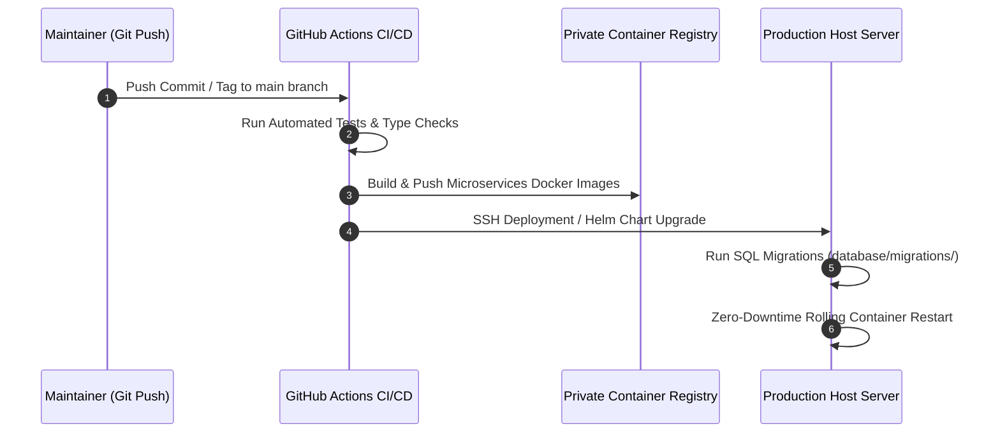

# Resumix AI — Managed Private Enterprise Recruitment Platform

---

## 1. Executive Summary & Case Study Overview

### Problem Statement
Enterprise HR departments receiving thousands of resume PDFs per job posting face four critical recruitment challenges:
1. **Time Inefficiency & High Latency**: Manual resume screening takes an average of 5–10 minutes per CV, creating severe hiring bottlenecks.
2. **Resource Waste & High Inference Costs**: Processing raw scanned or textless PDF documents directly through OCR or LLM models increases infrastructure costs by up to 400%.
3. **Unconscious Hiring Bias**: Sensitive Personally Identifiable Information (PII) such as photos, gender, age, religion, and full addresses can subconsciously influence reviewer decisions.
4. **ATS Black-Box Risk**: Legacy Applicant Tracking Systems (ATS) automatically reject candidates without providing explainable, transparent match score breakdowns.

### Solution: Resumix AI (Private Hosted Enterprise SaaS)
Resumix AI is engineered as a **Privately Hosted Enterprise Candidate Intelligence Platform**. HR recruitment teams access the platform through a secure, privately hosted web application portal managed and operated exclusively by the Maintainer (System Owner). 

The platform combines a `Decoupled Monorepo` microservices architecture, asynchronous queueing via `Redis BullMQ`, structured LLM parsing (`Groq, Gemini, OpenAI`), high-precision vector similarity search using `pgvector`, and an explainable multi-factor scoring algorithm.

> [!NOTE]
> **Private Platform Notice**: HR users and enterprise clients interact exclusively with the hosted web portal. The source code repository serves as a **System Architecture Portfolio & Engineering Capability Showcase** maintained exclusively by the System Owner. End-users do NOT need to clone or run code locally.

### Key Measurable Achievements & Metrics
| Engineering Metric           | Benchmark Result  | Business Impact & Strategic Advantage                                 |
|:-----------------------------|:-----------------:|:----------------------------------------------------------------------|
| **Ingestion API Latency**    |    `< 180 ms`     | Core API returns instant `HTTP 202` response via non-blocking queue.  |
| **Screening Efficiency**     |  `85% Reduction`  | Reduces candidate review duration from 10 minutes to under 2 seconds. |
| **Vector Similarity Search** |     `< 12 ms`     | Cosine HNSW query on 10,000+ candidate embedding vectors.             |
| **Zero-Text Short-Circuit**  |     `< 25 ms`     | Rejects scanned/textless PDFs instantly, avoiding wasted LLM costs.   |
| **Hiring Fairness & Bias**   | `0% PII Scoring`  | Photos, gender, age, & location attributes are strictly excluded.     |
| **Parsing Cost Efficiency**  | `$0.00 / parse`   | Utilizes free-tier LLM APIs & local SentenceTransformer models.       |

---

## 2. Visual Brand Identity & Design Tokens

Resumix AI adopts an **Enterprise Dark Blue Navy** visual design system—conveying trust, clarity, precision, and executive professionalism without purple hues.

| Token Name                              |                         Visual Preview                          | Application & Component Usage                           |
|:----------------------------------------|:---------------------------------------------------------------:|:--------------------------------------------------------|
| **Enterprise Obsidian (ink.DEFAULT)**   |  | Primary Bold Text, Header Titles, Card Headers          |
| **Deep Navy Text (ink.muted)**          |  | Body Paragraphs, High-Contrast Descriptions, List Items |
| **Slate Metadata (ink.subtle)**         |  | Captions, Subtitles, Form Field Hints                   |
| **Enterprise Navy Blue (Brand Accent)** |  | Primary Buttons, Active Tabs, Interactive Highlights    |
| **Light Canvas (Background)**           |  | Dashboard App Background, Input Fills                   |

---

## 3. High-Level System Architecture Overview

Resumix AI separates responsibilities cleanly between Web Dashboard, Core API Gateway, Async Worker Engine, and AI Microservice.

```mermaid
graph LR
    subgraph Client Layer (Private SaaS Portal)
        WebUI["Web UI (Next.js 14 / React 18)\n- Tailwind CSS & Lucide Icons"]
    end

    subgraph BFF Gateway Layer
        CoreAPI["Core API Service (Node.js / Express)\n- Auth & RBAC\n- Temporary Signed URL\n- BullMQ Enqueue"]
    end

    subgraph Ingestion & Job Worker
        Redis[("Redis Ingestion Queue")]
        Worker["BullMQ Worker Engine (TypeScript)"]
    end

    subgraph AI Microservice Pipeline
        AIService["AI Microservice (FastAPI / Python 3.11)"]
        PyMuPDF["PyMuPDF Parser\n(Zero-Text Rejection)"]
        LLM["Groq LLM (llama-3.1-8b-instant)"]
        Embedder["Sentence Transformers\n(384-dim Dual Embeddings)"]
        Scoring["Multi-Factor Scoring Engine"]
    end

    subgraph Persistence Layer
        DB[("PostgreSQL 15 + pgvector\n(13 Tables & HNSW Index)")]
        Storage[("Cloudflare R2 Storage\n(Encrypted Private S3 Buckets)")]
    end

    WebUI -->|HTTP REST / JSON| CoreAPI
    CoreAPI -->|Signed Storage Path| Storage
    CoreAPI -->|Enqueue Ingestion Job| Redis
    Redis -->|Consume Task| Worker
    Worker -->|POST /evaluate| AIService
    
    AIService --> PyMuPDF
    PyMuPDF --> LLM
    LLM --> Embedder
    Embedder --> Scoring
    
    Scoring -->|Return JSON + Dual Vectors + Score| Worker
    Worker -->|Update Results & Embeddings| DB
```

---

## 4. Key Feature Highlights & Algorithms

1. **Zero-Text Short-Circuit Rule**:
   - If a PDF file has no readable text layer (`len(raw_text.strip()) == 0`), the system returns `HTTP 400 NO_TEXT_LAYER` instantly and flags the document as `needs_review` for HR intervention without burning LLM inference tokens.
2. **PII-Safe LLM Extraction**:
   - Structured resume parsing via Pydantic schemas using Groq LLM (`llama-3.1-8b-instant`). Sensitive PII attributes (photo, gender, age, religion) are omitted from extraction schemas by design.
3. **Deterministic Skill Normalizer**:
   - Maps skill variations (e.g., `"NodeJS"`, `"Node.js"`, `"Node JS"`) to standardized taxonomy dictionaries (`SYNONYM_DICTIONARY`).
4. **Dual-Vector Similarity Search (`pgvector`)**:
   - Generates two 384-dimensional vector embeddings (`candidate_skill_embedding` & `candidate_role_embedding`) for high-precision HNSW cosine similarity search in PostgreSQL.
5. **Explainable Multi-Factor Scoring Engine**:
   - Computes transparent final match scores (0.0 – 100.0) combining: 45% Semantic Cosine Match, 30% Mandatory Skills Match, 20% Experience Duration Match, and 5% Preferred Skills Bonus, applied with strict missing mandatory skill penalties.
6. **Automated Data Retention & Demo Auto-Purge Policy (UU PDP / GDPR Compliance)**:
   - Features Demo Auto-Purge Mode (< 24h automatic Cloudflare R2 file cleanup for demo privacy & zero storage bloat) and Enterprise Retention Windows (`CV_RETENTION_DAYS`, e.g. 30/60/90 days) in compliance with UU PDP & GDPR data minimization rules.

---

## 5. HR User Workspace & Operational User Manual

HR Recruiters and Hiring Managers access the platform via the managed web dashboard. The operational workflow is structured into four core stages:

### Step 1: Secure Login & Vacancy Management
1. Log in to the Resumix AI Web Workspace using assigned enterprise credentials.
2. Create a new Job Vacancy posting by defining:
   - Job Title & Seniority Level.
   - Mandatory Skill Requirements & Preferred Skills.
   - Minimum Experience Duration (Months).
3. *Automation*: The platform automatically parses the job description and generates `job_skill_embedding` and `job_role_embedding` vectors.

### Step 2: Asynchronous CV Resume Ingestion
1. Select the relevant Job Vacancy in the HR Dashboard.
2. Drag and drop candidate resume PDF files into the Dropzone uploader.
3. The system immediately issues an `HTTP 202 Accepted` confirmation (< 180 ms response time) while processing resumes asynchronously in the background via BullMQ queues.

### Step 3: PII-Masked Candidate Screening & AI Scoring Review
1. View candidate applications ranked by their **Job Match Score** (0.0 – 100.0).
2. All candidate cards present PII-masked profile data to guarantee 100% unbiased evaluation.
3. Click on any candidate to inspect the **Explainable Match Score Breakdown**:
   - **Semantic Cosine Similarity**: AI vector match against job requirements.
   - **Mandatory Skill Coverage**: Matched vs missing mandatory skills (with strict penalty alerts).
   - **Domain Experience Alignment**: Verified work history duration.
   - **Zero-Text Warning Flag**: Instant alert if a PDF is scanned or lacks text (`needs_review`).

### Step 4: Vector Similarity Candidate Search
1. Utilize the built-in **pgvector Similarity Search** to find cross-vacancy talent across the historical candidate pool.
2. Adjust cosine threshold parameters to discover top matching candidates instantly.

---

## 6. Private Enterprise Infrastructure & CI/CD Topology (Maintainer Ops)

The underlying cloud infrastructure, microservices orchestration, and release deployment pipelines are managed exclusively by the System Owner (Maintainer).

### High-Level Enterprise Cloud Architecture

```mermaid
graph TD
    subgraph Edge & Security Layer
        DNS["Enterprise DNS / Cloudflare"] --> TLS["Reverse Proxy / SSL Termination (Nginx / Traefik)"]
    end

    subgraph Application Server Cluster (Private VPS / GCP / AWS)
        TLS --> WebPod["Next.js Web Frontend (Port 3000)"]
        TLS --> APIPod["Express Core API Gateway (Port 3001)"]
        APIPod --> RedisPod["Redis 7 Queue Cluster (Port 6379)"]
        RedisPod --> WorkerPod["BullMQ Async Worker Cluster"]
        WorkerPod --> AIPod["FastAPI AI Microservice Engine (Port 8000)"]
    end

    subgraph Persistence & Managed Storage
        APIPod & WorkerPod --> PostgreSQL[("Managed PostgreSQL 15 + pgvector\n(Encrypted at Rest)")]
        APIPod --> Storage[("Cloudflare R2 Private Storage\n(Time-Limited Signed URLs)")]
    end
```

### CI/CD Release & Deployment Pipeline



### Penetration Testing & OWASP API Security Mitigation
The platform enforces a **Zero Public API Spec Reconnaissance Policy** and strict Docker network isolation. For comprehensive details on OWASP API Security Top 10 mitigations and pentest defense controls, refer to **[docs/SECURITY_HARDENING.md](docs/SECURITY_HARDENING.md)**.

---

## 7. Licensing & Legal Notice

This repository contains the architecture specification and source code for the **Resumix AI Private Enterprise Platform**, published as a **Technical Portfolio & Engineering Capability Showcase**.

### Usage Licenses:
* **Source Code (`apps/`, `packages/`, `database/`)**: Protected under the [GNU Affero General Public License v3.0 (AGPL-3.0)](LICENSE). Any derivative works or network deployments must be open-sourced under AGPL-3.0.
* **Documentation & Architecture (`README.md`, `ARCHITECTURE.md`, `docs/`)**: Protected under [Creative Commons Attribution-NonCommercial-ShareAlike 4.0 International (CC BY-NC-SA 4.0)](LICENSE-DOCS.md).

---

> [!IMPORTANT] **LEGAL NOTICE FOR HR, ENTERPRISES, & EVALUATORS**:
> 1. Corporate HR teams and technical evaluators are **welcome to review and evaluate** this repository as an engineering architecture portfolio.
> 2. **STRICTLY PROHIBITED**: Copying, reselling, or deploying this system or its architectural designs into independent or commercial products without explicit written authorization and commercial licensing from the copyright owner.
> 3. **NO PUBLIC CLONE OR INDEPENDENT RUNNING**: HR end-users do not clone or host this application. Platform access is delivered exclusively via the Maintainer's managed private environment.

---
*Resumix AI — Enterprise Recruitment Intelligence System.*

