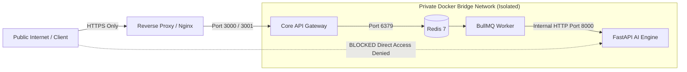

# Security Hardening & Penetration Testing Mitigation Specification

---

## 1. Executive Summary & Security Philosophy

Resumix AI is engineered with a **Defense-in-Depth Security Model** to protect enterprise candidate data and microservices infrastructure against malicious penetration testing, automated bot scans, and unauthorized data exfiltration.

Rather than relying on security through obscurity alone, the platform enforces strict network isolation, runtime API specification suppression, robust role-based access control (RBAC), and deterministic input sanitization across all Monorepo service boundaries.

---

## 2. Eight Core Security Pillars & Hardening Controls

```mermaid
graph LR
    subgraph Layer1 ["Layer 1: Edge & Network Boundary"]
        A["1. Zero Public API Spec Reconnaissance"]
        B["2. Internal Microservice Network Isolation (Docker Bridge)"]
    end

    subgraph Layer2 ["Layer 2: API Gateway & Auth Guard"]
        C["3. OWASP API Top 10 Mitigation Matrix"]
        D["4. Rate Limiting & Resource Exhaustion Defense"]
    end

    subgraph Layer3 ["Layer 3: Application & Privacy Controls"]
        E["5. PII Masking & Hiring Bias Prevention"]
        F["6. Short-Lived Signed URL Storage (TTL 300s)"]
        G["7. Secret Hygiene & Environment Isolation"]
        H["8. Automated Data Retention & Auto-Purge Policy"]
    end

    Layer1 --> Layer2
    Layer2 --> Layer3
```

---

### Pillar 1: Zero Public API Spec Reconnaissance (Attacker Surface Reduction)
To prevent malicious actors from mapping endpoint structures, parameter lists, and object schemas during penetration testing:
1. **Disabled Runtime Swagger UI**: In production environments, FastAPI `apps/ai-service` explicitly disables interactive API documentation endpoints (`docs_url=None`, `redoc_url=None`, `openapi_url=None`).
2. **Sanitized Public Documentation**: Repository Markdown documentation (`README.md`, `ARCHITECTURE.md`) omits raw REST endpoint URI paths and internal JSON payload structures, presenting only high-level conceptual service boundary specifications.

---

### Pillar 2: OWASP API Security Top 10 Mitigation Matrix

| OWASP Risk Category | System Vulnerability Threat | Implemented Mitigation & Hardening Mechanism |
|:--------------------|:----------------------------|:---------------------------------------------|
| **API1: BOLA (Broken Object Level Auth)** | User accessing candidate CVs belonging to another vacancy/tenant. | Core API enforces strict SQL tenant scoping (`job_id` & `company_id`) on all database queries and storage access handlers. |
| **API2: Broken Authentication** | Unauthorized API invocations via forged credentials. | JWT Token verification with short expiration, hashed passwords (bcrypt), and RBAC middleware on Express API Gateway. |
| **API3: Broken Object Property Auth** | Mass assignment of sensitive administrative fields. | Strict TypeScript DTOs in `packages/contracts` and Pydantic schemas in `apps/ai-service` strip unapproved payload fields. |
| **API4: Unrestricted Resource Consumption** | Denial of Service (DoS) via massive or unparseable PDF uploads. | Instant Zero-Text PDF Short-Circuit (`< 25 ms`) rejecting textless files before LLM inference, combined with 10 MB strict upload limit. |
| **API5: Broken Function Level Auth** | Standard HR recruiter invoking administrative endpoints. | Express RBAC guards (`checkRole(['admin'])`) intercepting privileged endpoints before controller execution. |
| **API6: Unrestricted Access to Sensitive Flows** | Automated spamming of CV processing queue. | Redis BullMQ job rate limiting, SHA-256 document hash deduplication, and HTTP 202 async queuing throttling. |
| **API7: Server-Side Request Forgery (SSRF)** | Exploiting PDF parsing to fetch internal network metadata. | PyMuPDF text extraction operates strictly on in-memory byte arrays without executing embedded PDF JavaScript or external URI fetches. |
| **API8: Security Misconfiguration** | Verbose stack traces exposing internal paths or API keys. | Standardized global error handlers in FastAPI & Express returning sanitized error codes (e.g. `NO_TEXT_LAYER`, `INVALID_CREDENTIALS`) without stack dumps. |
| **API9: Improper Inventory Management** | Direct public access to internal AI microservice endpoints. | Microservice port 8000 is isolated within private Docker bridge networks (`backend-net`) and inaccessible to external host interfaces. |
| **API10: Unsafe Consumption of APIs** | LLM hallucination or prompt injection altering candidate score. | Groq LLM outputs are validated against Pydantic schemas, feeding a deterministic mathematical scoring engine rather than LLM text scores. |

---

### Pillar 3: Internal Microservice Network Isolation
The FastAPI AI Microservice (`apps/ai-service`) functions exclusively as an internal computation engine.

- External traffic cannot reach Port 8000 directly.
- All requests to the AI processing pipeline are mediated asynchronously by BullMQ queue workers operating within the private network container bridge.

---

### Pillar 4: Resource Exhaustion & DoS Defense
Processing PDF documents and executing LLM inference creates computational overhead. Resumix AI implements a 3-tier resource protection rule:

1. **Tier 1: Zero-Text Layer Short-Circuit (`< 25 ms`)**:
   - PyMuPDF immediately counts readable character streams (`len(raw_text.strip())`).
   - If `len == 0` (scanned image PDF), execution terminates instantly with `HTTP 400 NO_TEXT_LAYER`, saving 100% of LLM inference cost and CPU cycles.
2. **Tier 2: File Size Cap (10 MB)**:
   - Synchronous payload inspection rejects files exceeding 10 MB prior to buffer allocation.
3. **Tier 3: SHA-256 Hash Deduplication**:
   - Incoming PDF files are hashed (`candidate_documents.file_hash`). Duplicate uploads retrieve pre-computed evaluation snapshots without re-running parsing.

---

### Pillar 5: PII Sanitization & Hiring Fairness
To guarantee 100% compliance with data privacy regulations (GDPR, PDP) and eliminate hiring bias:
- **Excluded Attributes**: Candidate photos, gender, age, religion, marital status, and physical addresses are strictly excluded from Pydantic extraction models.
- **Log Sanitization**: Telemetry systems, Winston loggers, and FastAPI logs are explicitly sanitized to prevent raw CV text or email addresses from printing to `stdout` / `stderr`.

---

### Pillar 6: Private Object Storage & Temporary Signed URLs
1. Candidate CV documents are stored in encrypted, private Cloudflare R2 S3-compatible buckets (`R2_BUCKET_NAME`).
2. **No Public Bucket Access**: Direct public URL access to CV blobs is disabled (`public = false`).
3. **Time-Limited Signed URLs**: When HR recruiters view PDF previews in the web dashboard, the Core API generates a temporary signed URL with a maximum Time-To-Live (TTL) of 300 seconds.

---

### Pillar 7: Secret Management & Environment Security
- Database credentials, `JWT_SECRET`, `SUPABASE_SERVICE_ROLE_KEY`, and `GROQ_API_KEY` are injected exclusively via environment variables (`.env`).
- Hardcoded secrets inside source files are strictly prohibited and enforced via pre-commit audit scripts.

---

### Pillar 8: Automated Data Retention & Demo Auto-Purge Policy (UU PDP / GDPR Compliance)
To prevent perpetual data retention and comply with GDPR Article 5(1)(e) (Storage Limitation Principle) and UU PDP (Indonesian Personal Data Protection Law):

1. **Demo Environment Auto-Purge Mode (`CV_RETENTION_MODE=demo`)**:
   - In demo/sandbox environments, uploaded CV PDF files in Cloudflare R2 are automatically purged after a configurable interval (default: `DEMO_AUTO_PURGE_HOURS=1`).
   - Prevents R2 bucket bloat from test files and guarantees tester privacy.
2. **Enterprise Production Retention (`CV_RETENTION_MODE=enterprise`)**:
   - Production environments support configurable retention windows (`CV_RETENTION_DAYS`, e.g., 30, 60, or 90 days).
   - A scheduled background worker checks document timestamps (`candidate_documents.created_at`) and automatically purges expired PDF blobs from Cloudflare R2.
3. **Metadata Integrity & Anonymized Retention**:
   - Upon raw PDF purging from Cloudflare R2, the document status in PostgreSQL transitions to `purged`.
   - Anonymized skill match vectors and evaluation scores remain in PostgreSQL for historical talent analytics without retaining raw PDF files.

---
*Resumix AI — Enterprise Security Hardening & Pentest Defense Specification.*
