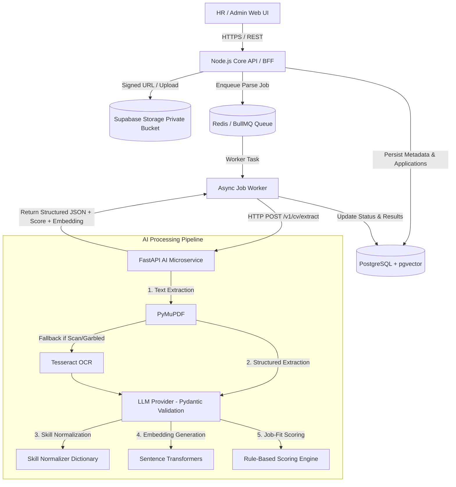

# Architecture Specification: CV ATS Pipeline

Dokumen ini menjelaskan arsitektur target, batas layanan (*service boundaries*), alur data asinkron, serta standar teknis untuk sistem **CV ATS Pipeline**.

---

## 1. Ringkasan Arsitektur

Sistem dirancang dengan arsitektur **Microservices / Decoupled Monorepo** yang menempatkan manusia (HR Recruiter) sebagai pengambil keputusan rekrutmen (*decision-support tool*).



---

## 2. Service Boundaries & Responsibilities

| Service | Tanggung Jawab Utama | Hal yang Dilarang |
| :--- | :--- | :--- |
| **Frontend (`apps/web`)** | UI/UX HR, form lowongan, upload dropzone, status tracking, preview PDF, review hasil AI. | Memegang API keys/secrets, menghitung skor otoritatif, query langsung ke DB. |
| **Node.js Core API (`apps/api`)** | Auth/RBAC, manajemen domain (Jobs, Candidates, Applications), signed URL generation, orkestrasi queue. | Parsing PDF/OCR/LLM secara langsung pada request handler HTTP sinkron. |
| **Job Worker (`apps/api/src/worker`)** | Mengambil job dari Redis Queue, retry management, memanggil AI service, memperbarui status DB. | Menentukan keputusan rekrutmen kandidat secara otomatis. |
| **FastAPI AI Service (`apps/ai-service`)** | PDF parsing, OCR fallback, structured LLM extraction, Pydantic validation, embedding generation, scoring calculation. | Menulis langsung ke database utama tanpa melalui kontrak API/worker. |
| **PostgreSQL + pgvector (`database`)** | Data relasional ternormalisasi, ranking similarity vector, audit logs, tracking job status. | Menyimpan berkas PDF mentah secara langsung. |
| **Private Object Storage (`Supabase Storage`)** | Penyimpanan file PDF CV secara privat. | Menjadi bucket publik tanpa signed URL. |

---

## 3. Workflow Ingestion & Processing Asinkron

```text
[HR/Kandidat] Upload PDF 
   └─> API Node.js memvalidasi file (MIME, size max 10MB, encryption check)
   └─> File disimpan ke Supabase Storage private bucket (`cv-files/raw/...`)
   └─> Record `applications` dibuat (status: `applied`), `candidate_documents` (parse_status: `uploaded`)
   └─> Job dikirim ke Redis Queue (`processing_jobs` status: `queued`)
   └─> Respon HTTP langsung dikembalikan ke Client (< 200ms)

[Worker Engine]
   └─> Worker mengambil job dari queue (parse_status: `processing`)
   └─> Worker memanggil FastAPI `/v1/cv/process`
   └─> FastAPI: PyMuPDF -> Quality Check -> OCR Fallback (Tesseract) jika < 65% readable
   └─> FastAPI: Structured Extraction via LLM -> Pydantic Schema Validation -> Normalisasi Skill
   └─> FastAPI: Embedding Generation & Calculation score breakdown (0-100)
   └─> Worker menyimpan `parsed_cv_json`, `candidate_skills`, `profile_embedding`, `score_breakdown` ke PostgreSQL
   └─> parse_status diperbarui menjadi `processed` (atau `needs_review` jika ada warning / `failed` jika error)
```

---

## 4. Keamanan Data & PII Guidelines

1. **Private Bucket & Signed URL**: File CV tidak pernah diakses melalui URL publik permanen. HR mengakses PDF via Temporary Signed URL (TTL max 300 detik).
2. **PII Handling**: Nama, email, telepon, dan alamat adalah data sensitif. Telemetry & log tidak boleh mencetak isi CV mentah.
3. **No Automatic Decision**: AI hanya berfungsi sebagai *decision support* (memberikan skor breakdown dan bukti ekstraksi).
4. **Scoring Fairness**: Atribut sensitif (foto, jenis kelamin, usia, agama, marital status) dilarang dimasukkan dalam model scoring atau embedding lowongan.

---

## 5. Struktur Repository Monorepo

```text
cv-ats-pipeline/
├── apps/
│   ├── web/                         # Next.js 14+ Frontend (TypeScript + Tailwind)
│   ├── api/                         # Node.js / Express Core API & Queue Worker
│   └── ai-service/                  # FastAPI Python AI Microservice
├── packages/
│   ├── contracts/                   # Shared DTOs, JSON Schemas, OpenAPI Specs
│   └── config/                      # Base TSConfig & ESLint configs
├── database/
│   ├── migrations/                  # PostgreSQL SQL Migrations (12 Core Tables)
│   ├── seeds/                       # Development & Test Seed Data
│   └── functions/                   # Custom Database Functions & pgvector Queries
├── docs/
│   ├── architecture.md              # Dokumen Arsitektur Utama
│   ├── brainstorming-rag-pipeline.md# Dokumen Brainstorming Pipeline
│   ├── front-end-pipeline.md        # Panduan & Spesifikasi Frontend UX
│   ├── api.md                       # Kontrak REST API v1
│   ├── scoring.md                   # Formula & Spesifikasi Scoring
│   ├── security.md                  # Keamanan, PII, & RBAC
│   └── evaluation.md                # Evaluasi Kualitas AI & Corpus Test
├── infra/
│   ├── docker/                      # Multi-stage Dockerfiles
│   └── scripts/                     # Helper & Setup Scripts
├── docker-compose.yml               # Production Orchestration
├── docker-compose.dev.yml           # Development Orchestration with Hot-Reload
├── .env.example                     # Template Environment Variables
├── README.md                        # Master README Workspace
└── AGENTS.md                        # Panduan Operasional AI Agent
```
